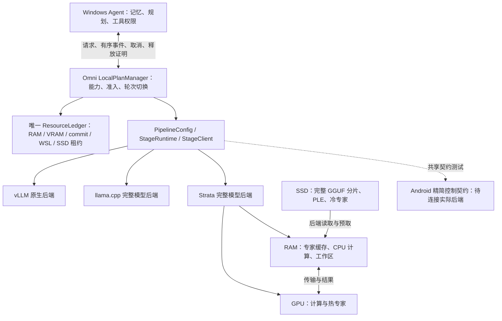

# Omni 本地推理引擎：Strata 集成状态与路线图（2026-10-08）

本次交付是 Omni 的工程接入、可复现的准备与测量工具，以及明确的准入拒绝。
**尚未完成 Qwen3.8 Flash Next 的本机完整请求或性能资格**。权重下载尚未完成；
当前可用 RAM、Windows commit 和显存也不足以承诺目标配置可以启动。
不能把接口测试、上游 mock 服务或外部 RTX 5070 的记录当成本机模型结果。

本实现延续[已接受架构](../../../analysis/architecture_local_engine_20260915.md)。
所有实验固定 batch size 1、单活跃请求；vLLM 原生执行与缓存路径继续保留。

图中的 GPU/RAM/SSD 是后端职责边界，不是已经验证的实际放置。
共享内存 GPU/NPU 只使用一个物理 RAM 池；Windows RAM 与 WSL 限额分别约束。

## 已实现的边界

| 边界 | 本次实现 | 验证或限制 |
| --- | --- | --- |
| 产物身份 | 全部分片、辅助文件、大小、SHA-256、checkpoint/revision、许可证及量化/剪枝/蒸馏/转换谱系；源 GGUF、兼容 pack、运行时分别绑定 | 拒绝缺片、错误角色、路径越界、哈希变化；本地生成哈希不冒充发布者证明 |
| 共享准入 | 引擎层 `LocalPlanManager` 和 `ResourceLedger`；Agent 与 StageRuntime 传递同一个精确租约 | RAM、VRAM、commit、WSL、SSD 分项预算；未排空的资源隔离并阻止重新加载 |
| Strata stage | 固定运行时、受监督进程、单活跃请求、有界 SSE、ACK、状态序号、超时、取消、进程树排空 | 注册 `external.strata.text.v1`；实际计算位置和不可观测缓存指标保持 unknown |
| 三层内存声明 | 分开表示 GPU 常驻、CPU 常驻/映射、专家缓存、PLE、KV、工作区、传输、加载峰值和 SSD 文件 | 声明预算不是实测峰值；当前 `three_tier_memory_qualified=false` |
| 静态卸载 | 保留 llama.cpp GPU 层数及 `--n-cpu-moe`；增加多分片完整验证和总权重计账 | 尚未完成与 Strata 同产物、同输入的整请求配对实验 |
| 准备与 profiling | 固定目标、兼容打包记录、24/32/40 GiB 缓存变体、可恢复请求证据、三档输入、取消/恢复和连续运行 | 逻辑读量与物理 SSD I/O 分开；系统磁盘计数不能冒充模型物理读取 |
| Agent | 复用现有循环、记忆和批准边界；共享引擎租约；显示明确拒绝原因 | 未验证的 Strata 放置不能进入 Agent；没有新增默认合格路线 |
| Android | C++17 精简控制层与 Python 共享 v2 契约；Gemma E2B/E4B、Qwen27B 候选清单 | 只通过主机契约测试；JNI、实际模型适配器、NDK 和手机运行未完成 |

实现不提供独立的专家调度器或 kernel。专家选择、缓存和读取仍由 Strata 或选定的阶段后端拥有。
Windows 工具仍由 Agent 的权限边界执行，模型后端没有工具执行权。

## 独立路线与当前阻碍

| 路线 | 固定产物 | 当前状态 | 下一道验收 |
| --- | --- | --- | --- |
| Strata RAM Q2 | ISTA Q2_0，66,423,878,624 B，不含 projector | 清单与准备工具完成；完整分片下载中 | 校验全部权重、打包、关闭 MTP 的文本请求、同 GGUF llama.cpp 对照 |
| Strata RAM IQ3 | ISTA IQ3_XXS，75,839,998,528 B，不含 projector | 清单完成；下载排队中 | 独立准入及完整文本质量/延迟；不能继承 Q2 结论 |
| Strata SSD Q4 | Unsloth UD-Q4_K_XL，111,334,654,784 B，四分片 | 固定 Windows 运行时已校验；模型下载中 | 24/32/40 GiB 缓存逐项准入、完整文本、真实 I/O 与取消/恢复 |
| DeepSeek V4.1 | 七分片 Q2_K，264,515,279,456 B | 固定元数据与专用运行时版本；未下载或执行 | 专用 CPU mmap 基线、显式运行选项、受控缓存，Windows 单独验证 |
| Android | Gemma 4 E2B/E4B、Qwen3.8-27B IQ1_S | 候选身份与控制契约完成 | 实际 LiteRT-LM/llama.cpp 适配器，再做设备本地验证 |

上述大小均为十进制字节总量，不是 RAM 峰值。RAM 路线仍有 SSD 支持的 PLE；
它的名字不意味着整个 GGUF 常驻 RAM。Q4 的首分片只有 10,946,624 B，单独下载它不算取得模型。
第三方量化卡与上游 checkpoint 的许可证差异保留为待核实项。

[本机准入记录](results/strata_20261008/local_readiness.json)捕获的可用物理 RAM 为
12,294,774,784 B，Windows commit 为 2,320,498,688 B，显存为 6,738,694,144 B。
24/32/40 GiB 专家缓存的下界检查均在分配前拒绝；这些不是完整模型加载实验，也不是硬件永久容量结论。
Strata 启动前会重新探测，不能沿用旧快照。没有通过修改 pagefile、清理用户程序或系统换页绕开准入。

## 原始证据与复现

- [本次证据说明](results/strata_20261008/README.md)：测试边界、原生协议检查、共享租约 smoke 和容量拒绝。
- [Strata 架构、准备和完整测量命令](STRATA.md)。
- [DeepSeek 专用运行时与未完成项](configs/deepseek/README.md)。
- [移动候选与证据层级](configs/mobile/README.md)。
- [原生控制契约](../../packages/omni-stage-controller/README.md)。
- [Agent 独立状态](../edge_agent/STATUS.md)。

固定 Strata `d5ea7133741e67743c0e886bb426c0ce8d69cf6c`。
其服务模式不接受 `--spec 0`：关闭 MTP 的基线不加载 draft，并使用
`--suffix-draft 0 --lookup-chain 0 --spec 2` 的普通单 token 路径。
内部 verify window 单独记录，不把它写成启用了 MTP。

## 后续推进顺序

1. 完成并验证全部分片；记录 pack 转换、实际运行包与二进制来源。当前下载任务开启逐文件 SHA-256 校验。
2. 在实际可用 RAM/commit/VRAM 足够时，先跑 Q2 文本，再跑 IQ3、Q4；不足时保留明确的准入拒绝。
3. 同 GGUF 与 llama.cpp 静态卸载配对；先关闭 MTP，再独立比较 MTP、预取和 24/32/40 GiB 缓存。
4. 补齐可归属的物理 SSD I/O、实际计算位置和文件缓存峰值观测；未核实前不宣称受控三层内存资格。
5. 完成真实图像、中文、代码、工具、记忆、多轮及取消恢复质量；三档各 20 次、独立冷启动和连续 30 分钟。
6. 只有通过完整任务、内存、稳定性和安全门槛的路线才能签署 Agent 资格；同等成功率按完整回答 p95 选择。
7. 在桌面正确性基线后接 DeepSeek 专用运行时；Android 先实际后端适配，再做真机验收。
   AI Hub 功能回放与手机常驻资格继续分开，设备本地内存、热稳定性和延迟仍需设备 shell。

正常回答 p95 10 秒、升级回答 60 秒是验收目标。当前没有本次 Strata 测量值可与目标比较。
