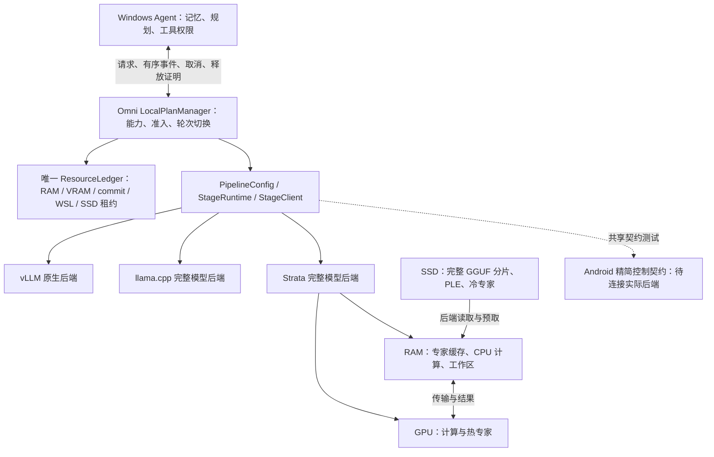

# Omni 本地推理引擎：Strata 集成状态与路线图（2026-10-08）

新原生 I/O 版本的[真实 Q4 请求及取消/恢复](results/strata_20261008/native_q4_observed_io.json)
已通过：英文、中文算术、JSON 三条完整请求分别为 **10.78 / 17.62 / 16.43 秒**，
每条取得有序、绑定进程和请求身份的 prefill/decode/整段原生读取记录。
两个文本 chunk 后取消，**2.72 秒**确认排空；新 worker 用同一控制配置完成
精确恢复回答，最终账本为空、进程退出、源码未变化。初次及恢复启动
**281.60 / 273.62 秒**包含全量哈希，不能称为纯模型加载。实际加载的 EXE、
cuBLAS/Lt 和驱动模块已核对；三条完成请求的读取错误及映射回退增量均为 0。
这是独立 CUDA 13.4 运行时的窄范围文本验证，尚未在该版本复跑 Agent。
每类仅一条样本，运行电源条件未独立记录；不是 p95、物理 SSD 测量或三层内存资格。
[独立复核](results/strata_20261008/native_q4_observed_io_review.json)通过 12 项检查；
后续格式化及换行规范化未改变 AST，但改变了源码/路线身份；已保留实测版本，
最终源码资格仍需重新注册路线及复跑。

最新准备进度：[ISTA Q2/IQ3 的全部权重及独立视觉投影](results/strata_20261008/ista_artifact_inventory.json)
已下载完成并逐文件独立验证 SHA-256；两条文本路线的
[兼容 pack、启动配置和准入预检](results/strata_20261008/ista_preparation.json)
也已完成并独立复核。它们分别使用 8 GiB 专家 RAM 预算、4K 上下文、FP16 KV，
关闭 MTP 和预取；仍是 SSD 支持的缓存实验，尚未执行神经请求或取得图像资格。

用于补齐读取证据的[原生 I/O 观测补丁](runtime_patches/README.md)已在隔离源码上
完成 Windows CUDA 13.4 构建；固定了补丁、七个源文件、ggml 依赖、编译日志、
可执行文件和 cuBLAS DLL。[构建记录](results/strata_20261008/native_io_build.json)、
CLI 与完整运行时包静态校验通过，Windows/WSL 接入测试已通过并冻结代码；
该新二进制已完成上述独立神经验证。它分别报告逻辑权重读取和操作系统直接传输，
物理 SSD 流量仍为 unknown，不继承以下旧运行时的神经请求结果。

最新的[Windows Qt Agent 实际请求](results/strata_20261008/native_q4_qt_agent.json)
已通过：真实 Q4 模型经离屏 Qt 界面发送、Omni 执行、有序流式显示、精确回答及关闭释放。
模型调用耗时 **15.59 秒**，Omni 提交到首个可见 SSE delta 为 **14.94 秒**；
两者都不是 Qt 渲染 TTFT。包含提交前准备、全部文件哈希、启动和最终界面轮询的
边界为 **360.91 秒**，不能称为纯模型加载。仅一个短请求，且同 SSD 下载仍活跃，
不是 p95 或隔离性能结果。实际加载计划、控制哈希、原生计数和原始记录哈希
已独立复核；关闭后共享账本为空，原生进程退出。

新增的精确进程身份与 GPU 绑定采样获得 **73 个有效 WDDM 样本**，local 峰值
14,438,891,520 B，nonlocal 峰值 10,437,525,504 B。nonlocal 使用主机 RAM，
不能与进程 RSS 相加，也不是新增内存池。覆盖仅从原生进程身份可用后开始，
不证明加载峰值、瞬时峰值或总预算硬上限。首轮 Qt 尝试因固定运行时内出现
未登记 tokenizer 字节码而在神经执行前拒绝；文件已按哈希隔离，校验保留，
运行时代码预检提前到模型哈希之前。实际请求后修正了答案换行、路线提示和
完成状态，使用该请求的有序事件进行独立界面回放验证，未声称再次执行模型。
Strata 正式 profiling 的加载计划、控制与请求证据绑定已实现；发布资格仍不放宽。

最新的[真实取消与恢复记录](results/strata_20261008/native_q4_cancel_recovery.json)
已完成一轮：模型交付两个文本 chunk 后取消，2.59 秒确认排空，共享账本
reserved 全为 0、owner/quarantine 为空；随后同一账本下的新 worker 和新
代次完成精确短回答，`stop`，耗时 11.85 秒。初次/重载阶段启动分别为
236.50 / 218.04 秒，包含全部文件哈希与服务启动，不能称为纯模型加载。
这次保存了初次与恢复的实际完整加载计划，控制哈希均为
`2703784159f96a54b7301024d685d6fc0ae4e969f8d07fada9b4405b908a3e42`。
它只关闭一条实际模型文本流取消/恢复检查；其他 I/O/传输阶段、重复恢复、
稳定性与性能资格仍待验证，也不补写此前 Agent 未捕获的加载计划。

此前的[显式缓存 Agent 复跑](results/strata_20261008/native_q4_bounded_cache_agent.json)
已通过跨控制器会话的单条记忆召回与短英文回答，2/2，关闭及进程退出复核。
当前代码从已校验的原生布局与 7.5 GiB GPU 专家预算推导正数 `--expert-cache`
2016；profile 形状缓存实际报告 2572 个较小槽、7676 MiB，低于推导的
7678.125 MiB 上界，RAM arena 报告 8191 MiB，低于 8 GiB 预算。
本次保存了源代码/运行环境身份与原生 INFO，完整加载计划及控制哈希未捕获；
推导值明确标为重建，不冒充已记录的执行计划。包级源码摘要对应当时包含
保留的其他修改的本地工作树，不是干净 Git commit；关键接入文件另有逐文件
哈希。总 VRAM 硬上限与三层内存
资格仍未证明。两条完整 Agent 耗时为 266.39 / 21.51 秒，首条包含重新哈希
和加载；每类只有一条样本，21.51 秒不是 p95。首条 route 事件到 final
为 26.24 秒，不能称为冷加载或 TTFT。

此前 2026-10-08 已在本机 Windows 原生环境，经 Omni Strata 完整模型阶段运行
Qwen3.8-Flash-Next Unsloth UD-Q4_K_XL 的三条完整短文本请求。四个 GGUF
分片共 111,334,654,784 B，全部大小与 SHA-256 已核验。英文精确输出、中文
算术和 JSON 等值检查均通过，完成耗时分别为 **9.63 / 17.70 / 16.63 秒**，
最终均为 `stop`，关闭后共享资源账本排空。只有每类一条样本，**不是 p95、
性能资格或通用质量结论**。完整身份、原始记录哈希与数值见
[本机 Q4 复现证据](results/strata_20261008/native_q4_reproduction.json)。

此前自动缓存运行声明 CPU 专家缓存 8 GiB、总 host RAM 约 14 GiB + 1 MiB
（15,033,434,112 B）、VRAM 16 GiB、Windows commit 40 GiB，4K 上下文、
FP16 KV、MTP/预取关闭。冷阶段启动 129.48 秒
包含全部文件重新哈希，不能称为纯模型加载耗时。实际原生服务报告 GPU 专家
缓存 9616 MiB、arena 8189 MiB、CPU pool 8 workers；组件估计不是实测硬上限。
加载配置 `cpu+cuda:0` 已核实，逐请求原生计数也证明路由 decode 专家在 CPU
和 CUDA 上执行，但不扩大为全模型每个算子的计算位置证明。物理 SSD 读取、
直接 I/O 回退和文件缓存峰值仍未知，`three_tier_memory_qualified=false`。

现有 Agent 已通过同一引擎执行四条窄范围功能任务：短回答、同会话记忆
保存/召回、结构化本机 loopback 页面读取，任务检查 4/4，控制器正常关闭且
原生/Agent 进程退出已复核。第一条完整 Agent 耗时 259.31 秒包含重新哈希与
加载；后续三条为 18.95 / 20.99 / 32.03 秒。它们不是性能资格、跨会话记忆、
通用浏览器能力或默认路线资格，且仍使用本次自动缓存不一致的配置。
最新复跑补充了单条跨会话记忆，但不能继承为广泛检索质量。
Q2/IQ3 RAM 路线、同 GGUF llama.cpp 配对、真实图像、长上下文、其他取消阶段
与重复恢复、
三档各 20 次和 30 分钟
连续运行仍待完成。首次配置转换清单校验失败及其排空记录保留在新证据中。
此前原始容量拒绝和未完成下载记录保留为带日期的历史快照，不能解释为
永久硬件限制；当前路线状态见下表。

本实现延续[已接受架构](../../../analysis/architecture_local_engine_20260915.md)。
所有实验固定 batch size 1、单活跃请求；vLLM 原生执行与缓存路径继续保留。

本日 Q4 神经请求与两轮 Agent smoke 运行时，同一 SSD 上仍有 ISTA Q2/IQ3
下载及 WSL 校验任务。这些是有后台磁盘负载的功能实验，耗时不能作为隔离的
性能测量或后端配对比较；上述取消/恢复实验同样保留这一条件。

图中的 GPU/RAM/SSD 是后端职责边界，不是已经验证的实际放置。
共享内存 GPU/NPU 只使用一个物理 RAM 池；Windows RAM 与 WSL 限额分别约束。

## 已实现的边界

| 边界 | 本次实现 | 验证或限制 |
| --- | --- | --- |
| 产物身份 | 全部分片、辅助文件、大小、SHA-256、checkpoint/revision、许可证及量化/剪枝/蒸馏/转换谱系；源 GGUF、兼容 pack、运行时分别绑定 | 拒绝缺片、错误角色、路径越界、哈希变化；本地生成哈希不冒充发布者证明 |
| 共享准入 | 引擎层 `LocalPlanManager` 和 `ResourceLedger`；Agent 与 StageRuntime 传递同一个精确租约 | RAM、VRAM、commit、WSL、SSD 分项预算；未排空的资源隔离并阻止重新加载 |
| Strata stage | 固定运行时、受监督进程、单活跃请求、有界 SSE、ACK、状态序号、超时、取消、进程树排空 | 本机 Q4 三条短文本请求通过；加载 CPU+CUDA 配置及路由 decode 专家的两类执行分别验证，其他算子与物理 SSD 指标保持 unknown |
| 三层内存声明 | 分开表示 GPU 常驻、CPU 常驻/映射、专家缓存、PLE、KV、工作区、传输、加载峰值和 SSD 文件；按原生进程代次与 GPU 身份采样 WDDM local/nonlocal | 已取得驻留阶段样本；未覆盖加载峰值或证明硬上限，nonlocal 不与主机 RSS 相加；当前 `three_tier_memory_qualified=false` |
| 静态卸载 | 保留 llama.cpp GPU 层数及 `--n-cpu-moe`；增加多分片完整验证和总权重计账 | 尚未完成与 Strata 同产物、同输入的整请求配对实验 |
| 准备与 profiling | 固定目标、兼容打包记录、24/32/40 GiB 缓存变体、可恢复请求证据、三档输入、取消/恢复和连续运行 | 逻辑读量与物理 SSD I/O 分开；系统磁盘计数不能冒充模型物理读取 |
| Agent | 复用现有循环、记忆和批准边界；共享引擎租约；显式实验路线核验加载配置及产物身份 | 先前短回答、同会话记忆及结构化 loopback 读取 4/4；显式缓存复跑跨会话记忆/短回答 2/2；没有新增默认合格路线 |
| Android | C++17 精简控制层与 Python 共享 v2 契约；Gemma E2B/E4B、Qwen27B 候选清单 | 只通过主机契约测试；JNI、实际模型适配器、NDK 和手机运行未完成 |

实现不提供独立的专家调度器或 kernel。专家选择、缓存和读取仍由 Strata 或选定的阶段后端拥有。
Windows 工具仍由 Agent 的权限边界执行，模型后端没有工具执行权。

## 独立路线与当前阻碍

| 路线 | 固定产物 | 当前状态 | 下一道验收 |
| --- | --- | --- | --- |
| Strata RAM Q2 | ISTA Q2_0，66,423,878,624 B，不含 projector | 全部分片及独立投影已校验，文本 pack/启动配置完成，8 GiB 缓存准入预检通过；未执行模型 | 启动时重新准入、关闭 MTP 的完整文本请求、同 GGUF llama.cpp 对照 |
| Strata RAM IQ3 | ISTA IQ3_XXS，75,839,998,528 B，不含 projector | 全部分片及独立投影已校验，文本 pack/启动配置完成，8 GiB 缓存准入预检通过；未执行模型 | 独立完整文本质量/延迟；不能继承 Q2 或 Q4 结论 |
| Strata SSD Q4 | Unsloth UD-Q4_K_XL，111,334,654,784 B，四分片 | 新 I/O 运行时三条文本及取消/恢复通过，取得实际模块和逐请求读取证据；旧版本 Agent/Qt 窄范围通过；三层内存未合格 | 新运行时 Agent；其他 I/O/传输取消与重复恢复；同产物对照、物理 I/O、总体内存峰值及完整性能协议 |
| DeepSeek V4.1 | 七分片 Q2_K，264,515,279,456 B | 固定元数据与专用运行时版本；未下载或执行 | 专用 CPU mmap 基线、显式运行选项、受控缓存，Windows 单独验证 |
| Android | Gemma 4 E2B/E4B、Qwen3.8-27B IQ1_S | 候选身份与控制契约完成 | 实际 LiteRT-LM/llama.cpp 适配器，再做设备本地验证 |

上述大小均为十进制字节总量，不是 RAM 峰值。RAM 路线仍有 SSD 支持的 PLE；
它的名字不意味着整个 GGUF 常驻 RAM。Q4 的首分片只有 10,946,624 B，单独下载它不算取得模型。
第三方量化卡与上游 checkpoint 的许可证差异保留为待核实项。

本日较早的[本机准入记录](results/strata_20261008/local_readiness.json)捕获的可用物理 RAM 为
12,294,774,784 B，Windows commit 为 2,320,498,688 B，显存为 6,738,694,144 B。
当时 24/32/40 GiB 专家缓存的下界检查均在分配前拒绝；这些不是完整模型加载实验，也不是硬件永久容量结论。
较晚 Q4 8 GiB 专家缓存请求使用了重新探测的可用容量，不能把两次快照混为一次配置。
Strata 启动前会重新探测，不能沿用旧快照。没有通过修改 pagefile、清理用户程序或系统换页绕开准入。

## 原始证据与复现

- [新 I/O 运行时真实 Q4](results/strata_20261008/native_q4_observed_io.json)：四条实际完成请求（含恢复）、逐阶段读取、实际 DLL、取消不完整记录、源码稳定性和原始文件哈希。
- [新 I/O 运行复核](results/strata_20261008/native_q4_observed_io_review.json)：12 项独立检查、原始审计哈希和后续格式化的身份边界。
- [ISTA 完整产物校验](results/strata_20261008/ista_artifact_inventory.json)及[文本路线准备复核](results/strata_20261008/ista_preparation.json)：下载、逐文件 SHA、pack、转换清单、启动与绑定身份；不包含模型执行。
- [原生 I/O 补丁与隔离构建](runtime_patches/README.md)：构建配置、二进制身份及观测边界；新运行时神经验证待完成。
- [实际取消/恢复](results/strata_20261008/native_q4_cancel_recovery.json)：两条文本 chunk 后取消、精确账本排空、新 worker 恢复、实际加载计划/控制哈希及边界。
- [显式缓存 Agent 复跑](results/strata_20261008/native_q4_bounded_cache_agent.json)：新源代码身份、重建的缓存控制、原生 INFO、跨会话记忆/短回答及观测边界。
- [此前本机 Q4 完整请求](results/strata_20261008/native_q4_reproduction.json)：全部产物身份、三条短文本请求、旧自动缓存、加载/计算证据和先前失败。
- [本次证据说明](results/strata_20261008/README.md)：测试边界、原生协议检查、共享租约 smoke 和历史容量拒绝。
- [Strata 架构、准备和完整测量命令](STRATA.md)。
- [DeepSeek 专用运行时与未完成项](configs/deepseek/README.md)。
- [移动候选与证据层级](configs/mobile/README.md)。
- [原生控制契约](../../packages/omni-stage-controller/README.md)。
- [Agent 独立状态](../edge_agent/STATUS.md)。

固定 Strata `d5ea7133741e67743c0e886bb426c0ce8d69cf6c`。
其服务模式不接受 `--spec 0`：关闭 MTP 的基线不加载 draft，并使用
`--suffix-draft 0 --lookup-chain 0 --spec 2` 的普通单 token 路径。
内部 verify window 单独记录，不把它写成启用了 MTP。

## 后续推进顺序

1. Q4 全部分片、短文本、显式缓存 Agent 和一轮真实模型取消/恢复已完成窄范围检查；实际加载计划已在独立取消实验保存。接着覆盖其他 I/O/传输取消阶段与重复恢复，保留旧自动缓存和失败记录。
2. Q2、IQ3 的全部权重核验与文本打包已完成；接着独立完整请求，启动时按实际可用 RAM/commit/VRAM 重新准入，不足时保留明确拒绝。
3. 同 GGUF 与 llama.cpp 静态卸载配对；先关闭 MTP，再独立比较 MTP、预取和 24/32/40 GiB 缓存。
4. 原生逻辑读取和操作系统直接传输已取得逐请求证据；继续补齐可归属的物理 SSD I/O、更多实际计算位置和文件缓存峰值观测，未核实前不宣称受控三层内存资格。
5. 完成真实图像、中文、代码、工具、记忆、多轮及更多阶段/重复取消恢复质量；三档各 20 次、独立冷启动和连续 30 分钟。
6. 只有通过完整任务、内存、稳定性和安全门槛的路线才能签署 Agent 资格；同等成功率按完整回答 p95 选择。
7. 在桌面正确性基线后接 DeepSeek 专用运行时；Android 先实际后端适配，再做真机验收。
   AI Hub 功能回放与手机常驻资格继续分开，设备本地内存、热稳定性和延迟仍需设备 shell。

正常回答 p95 10 秒、升级回答 60 秒是验收目标。当前三条短文本样本不能计算合格 p95，也不能代替完整 Agent 回答测量。
