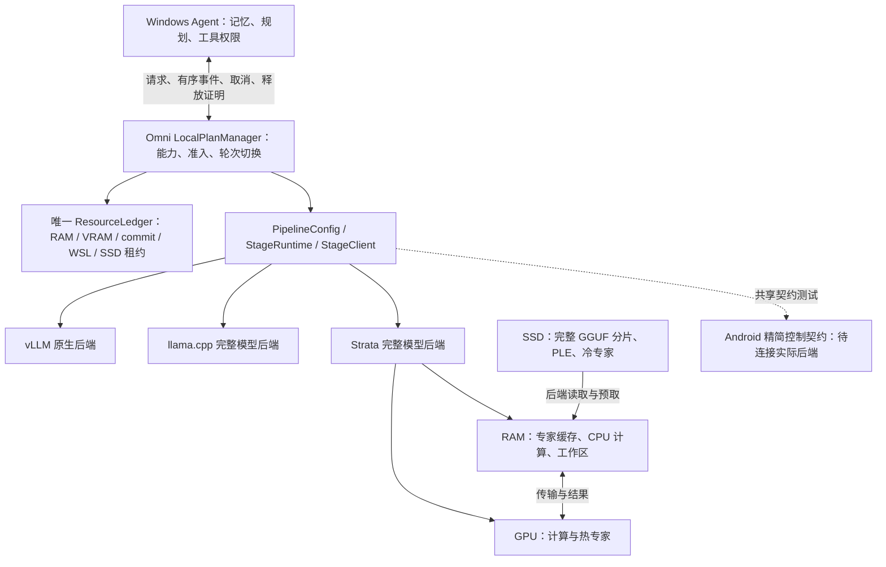

# Omni 本地推理引擎：Strata 集成状态与路线图（2026-10-09）

2026-10-09 最新进展：完整 I/O／执行观测已接入 Stage、运行时登记、Agent 路由和结果校验；
观测工作区、Windows commit 与证据磁盘预算分别计入现有账本。
[最新原生 Windows 回归及原始日志](results/strata_20261008/strata_execution_metadata_repairs_native_unit_validation.json)
为 **360 通过、3 跳过、161 个子测试通过**，覆盖实际 DONE 严格整数校验、Windows LF/CRLF
构建参数解析，以及仅绑定目标编译记录的 4 MiB 上限；通用 JSON 上限仍为 2 MiB。
原生 vLLM 为 `0.29.0+cu134`，与 Omni 0.29 主次版本一致；Stage 与两个新增公开测试通过仓库 Ruff 检查。
这是无神经执行的集成证据，不能作为新版模型或 Agent 实跑资格。

新增原生引擎已完成编译／链接与独立完整运行时打包。
[三次外部静态诊断及首次失败](results/strata_20261008/strata_execution_build_assembly_status.json)
分别保留基础仓库实验性 GGUF、CRLF、编译记录大小与 CUDA 路径投影的具体失败。
CRLF 和编译记录大小修补已接入生产代码并通过上述回归；最新完整诊断在
`target_dependency_projection_differs` 处终止。原因是 Ninja 保存 CUDA 头文件的 Windows 短名称，
而采集器保存长名称。实际 Win32 检查已确认 **11 对**路径具有相同文件身份，且内容与归档输入逐字节一致；
这仅证明当前路径／内容对应，不证明历史编译执行。精确证据消费与新运行包打包正在进行。
旧运行包和全部失败均保留；外部诊断不能授权旧包登记。
下一步是完整校验新包，实际运行模型参考比较、取消恢复和 Agent 复测。
下面 Q2／IQ3／Q4 的历史实跑继续绑定各自源码，不继承为新版资格。

2026-10-09：新增执行观测的 Stage 生命周期已接入现有完整模型后端，
包括独立资源准入、经源码校验的模块加载、有界认证诊断、实际 DONE 等待、
按 worker generation 分离证据，以及观测报告失败后的取消和资源清理。
[模型无关回归](results/strata_20261008/strata_execution_stage_unit_validation.json)
为 **105 通过、5 跳过、4 个子测试通过**，Ruff 通过；旧 bootstrap 字符串保持不变。
测试环境是 WSL，保留 vLLM 0.28／Omni 0.29 的版本告警，不证明原生 Windows 新运行时兼容性。
完整 I/O／执行观测运行时的源码身份对齐、打包及真实模型验证仍在进行；
本次没有安装新运行时或新增模型执行，也不授予默认、内存硬上限或物理 SSD 资格。
下面 442 条 Agent 请求属于其各自冻结源码，不继承到新接入路径。

2026-10-09：当前冻结 Q2 显式 Agent 路线已完成
[两类完整性能协议](results/strata_20261008/native_ista_q2_agent_native_profile_full_protocol.json)，
并通过[独立闭合与统计复核](results/strata_20261008/native_ista_q2_agent_native_profile_full_protocol_review.json)。
Windows 11、RTX 5090 Laptop（驱动 610.71、23.9 GiB VRAM）、63.1 GiB 物理 RAM，
固定 ISTA GSQ-RCO Q2_0 两分片、Strata `d5ea7133`＋I/O-v1 补丁、4K/FP16 KV，
8 GiB 专家 RAM 缓存、16 GiB GPU 预算，MTP/预取关闭，batch=1/单活跃请求。
基本任务与真实只读浏览器任务共 **442/442** 通过，含 12 条预热、120 条测量、310 条耐久请求，
实际模型调用 **594** 次。各类三档均独立预热两次、测量 20 次；p50/p95 为完整 Agent 回答秒数：

| 任务 | 短输入 p50 / p95 | 中输入 p50 / p95 | 长输入 p50 / p95 | 顺序耐久 |
| --- | ---: | ---: | ---: | ---: |
| 基本 | 7.244 / 7.480 | 8.053 / 8.356 | 8.880 / 9.450 | 224 请求，1,803.592 秒活跃时间 |
| 浏览器文本 | 17.591 / 18.221 | 18.786 / 19.814 | 26.722 / 27.303 | 86 请求，1,802.007 秒活跃时间 |

另计校验及控制器准备 **127.518 / 123.765 秒**，不能称为纯模型加载时间。
完整任务计时包含同步私有取证 I/O；可见首输出是校验后的 final，内部模型首 SSE 分开记录。
2,399 份闭合文件、1,563 份冻结源码、全部任务/原始回复/工具后续输入/状态序号、
两代原生进程退出和空账本已核验；公开 JSON 保留原始测量样本与输入、输出哈希，不发布内容。
50,274 条 WDDM 采样的 local/nonlocal 峰值分别为 **12,553,551,872 / 9,516,875,776 字节**，
是分开的采样下界，不能相加或与 RSS 相加，也不包含全部加载峰值。
基本任务 p95 达到 10 秒目标；浏览器任务未达到。电源方案只核验首尾一致，不证明全程方案不变或硬件隔离。
本轮完成的是两个固定中英文任务类的 P 级指定流水线协议，不能扩大为通用 Agent、视觉、其他量化或手机资格。
来源谱系、全算子放置、物理 SSD 归属、总内存硬上限和默认/发布资格仍未完成。
下一步：接入并实跑新增 CPU/CUDA/缓存观测，再用同产物比较缓存预算、静态卸载和整请求收益；
保留以下旧失败及 smoke 的各自证据范围。

2026-10-09：同一冻结 Q2 路线的真实
[NativeProfileBridge 浏览器 smoke](results/strata_20261008/native_ista_q2_agent_native_profile_browser_smoke.json)
通过[独立闭合复核](results/strata_20261008/native_ista_q2_agent_native_profile_browser_smoke_review.json)。
batch=1、单活跃请求，3 条预热＋6 条测量，共 **9/9** 中英文只读浏览器任务通过。
18 次实际模型调用完成模型提出 browser_open→真实自动 browser_read→观察进入第二次输入→最终答案；
全部 9 条后续输入均按实际工具结果重建核对。短／中／长各两条完整任务为
**18.264–18.575／18.846–20.364／25.877–27.355 秒**，另计 **125.469 秒**校验及控制器准备。
89 份闭合文件、1,563 份源码、逐步解析与状态序号、原生进程退出和空账本已核验；
实际 18 条回复均为原始 JSON。请求耗时含私有流式取证 I/O，可见首输出为校验后的 final。
浏览器关闭证据限于记录的引用、线程和 driver，不包含全部 Edge 后代进程枚举。
此轮是固定本地页面任务 smoke；三档各 20 次、30 分钟顺序运行、广泛任务质量、
物理 SSD 归属、总内存硬上限和默认/发布资格仍待完成。

2026-10-09：Qwen3.8-Flash-Next 的 ISTA Q2 显式 Agent 路线已通过真实
[NativeProfileBridge 基本任务 smoke](results/strata_20261008/native_ista_q2_agent_native_profile_basic_smoke.json)
及[独立闭合复核](results/strata_20261008/native_ista_q2_agent_native_profile_basic_smoke_review.json)。
batch=1、单活跃请求，3 条预热＋6 条测量，共 9 个中英文基础算术请求全部通过；
短／中／长输入各两条完整回答分别为 **7.586–7.687／7.892–8.228／8.676–9.161 秒**。
另计 **161.369 秒**完整性校验及控制器准备；请求耗时包含私有流式取证 I/O。
53 份闭合文件、1,563 份源码、全部输入/原始回复/消费轨迹、原生进程退出和空账本均已独立核验。
可见首输出是校验后的 final，内部模型首 SSE 单独记录。仅验证加载配置及 routed decode 的 CPU/GPU 专家计数；
整模型算子放置、物理 SSD 字节和总内存硬上限仍未知。WDDM local/nonlocal 分别记录，不能相加。
本轮基本任务没有浏览器或耐久阶段，不创建完整性能、来源谱系、默认或发布资格；独立浏览器 smoke 见上。

2026-10-09：原生 Agent profiler 的加载失败/取消路径现在等待实际加载线程终止，
再进入资源关闭，避免采样失败或重复取消使清理与加载竞争。
[受控线程测试](../../tests/edge/test_agent_profile_loader_drain.py)及相关集成回归
**119 通过、32 个子测试通过**；这是无模型执行的修补验证，修补后的独立实际基本 smoke 见上。

2026-10-09：[共享消费者轨迹校验](results/strata_20261008/agent_consumer_trace_unit_validation.json)
已接入原生 Agent profiler 和离线 reviewer；root 集成回归 **357 通过、6 跳过、166 个子测试通过**。
逐步输入哈希、可信任务和 URL 授权、工具参数、终止证明、输出可见时间及跨请求状态顺序统一核验；
六步元数据预算为 192 KiB，计入既有 2 MiB 消费者工作区，取消/关闭保留释放失败的资源归属。
该记录仅为单元/集成证据；发布时尚需原生模型复测，后续基本 smoke 见上，完整性能协议仍待完成。
旧严格 JSON 失败、历史实跑及未获默认/物理 SSD/总内存资格的结论保持原有范围。

2026-10-09：Q2 通过普通 Agent 请求完成[中英文模型工具链](results/strata_20261008/native_ista_q2_agent_model_tool_functional.json)，并通过[闭合证据复核](results/strata_20261008/native_ista_q2_agent_model_tool_functional_review.json)。
模型提出 browser_open→真实自动 browser_read→下一次模型调用返回参考标题；完整任务为 **23.97 / 28.11 秒**，另计 **166.13 秒**校验/启动。
14 份闭合文件、1,562 份指定源码、四次模型调用、观察传入下一输入、三代已记录进程和空账本均已核验。
四次回复均为原始 JSON，围栏仍无实际运行证据；范围限于两个本地标题任务，完整性能、稳定性和默认资格仍待完成。
此记录绑定运行时的源码；后续 profiling 修改须重新冻结及验证。旧严格 JSON 基准失败保持不变。

2026-10-09：[输出可见性修补](results/strata_20261008/agent_output_visibility_unit_validation.json)将完整 StageEvent 的 15 字段与证明的 7 身份字段按值和类型投影核对，拒绝错误或未释放资源。
root 已完成 WSL **114 项测试及 32 个子测试**；同一批五条闭合真实轨迹离线重放，可见最终答案由 **0/5 变为 5/5**。
该可见性记录没有新增模型执行、性能测量或默认资格；其发布时两个显式消费者完整轨迹门槛仍关闭，后续共享检查见上。
消费者解析源码、原始回复和旧严格 JSON 基准失败保持不变。

2026-10-09：当前显式输出契约的 [Q2 Agent 五任务与取消/恢复实跑](results/strata_20261008/native_ista_q2_agent_output_functional.json)
已正常结束，并通过[闭合证据复核](results/strata_20261008/native_ista_q2_agent_output_functional_review.json)。
Windows 原生、RTX 5090 Laptop、4K/FP16 KV、batch=1/单活跃请求，保留 8 GiB 专家 RAM 缓存、
16 GiB GPU 预算与 MTP/预取关闭；新增消费者工作区为 2 MiB，经过本轮独立准入。
短回答、记忆写入、新控制器召回、英文与中文浏览器任务分别为 **7.19 / 7.65 / 11.59 / 20.15 / 16.57 秒**，
不含两次 **196.48 / 190.78 秒**的全量校验及启动。首个内部原始增量触发取消，整个取消任务
从提交至排空为 **10.00 秒**，包含触发前的 prefill，不能称为单独取消延迟。
23 份闭合原始文件、逐调用解析证明、DPAPI 来源、原生序号、两代 worker、写入/采样停止和空账本均已核验。
本轮五次模型输出均为未加围栏的 JSON 最终答案；四次浏览器操作来自受控 Read URL 预处理。
真实模型提出工具调用、围栏解释、通用质量、p50/p95、30 分钟稳定性、总内存硬上限和物理 SSD 读取仍未获此记录资格。
当时的下一项是普通 Agent 请求的模型提出工具→浏览器观察→最终答案完整链；该链及两类完整性能协议已由上方后续记录完成，旧严格 JSON 基准失败保持不变。

2026-10-09：显式 Agent 输出契约已接入现有 Controller、完整模型后端与共享租约，
[实现和单元回归记录](results/strata_20261008/agent_output_contract_unit_validation.json)
绑定 14 个当前源码/测试文件。两组 WSL 回归分别为 **220 通过/2 跳过、110 通过**，
新增解析、工具权限、ACK/取消、隔离和账本测试；没有加载模型。
新消费者需独立路线身份及 2 MiB 工作区，保持权重/精度/缓存/传输/GPU 控制，重新准入。
原始输出、完整对象或单一 json 围栏的解释、规范化哈希分别记录；只在完整自然结束后执行动作。
模型首增量与已验证最终内容的可见时间分别报告。在该单元记录发布时，新路线尚未实跑；
最新指定任务实跑见上，仍无默认资格。旧严格 JSON 失败不变。接口见 [Strata 指南](STRATA.md#explicit-agent-output-contracts)。

2026-10-09：同一失败任务已在[独立新进程单独复测](results/strata_20261008/native_ista_q2_exact_format_diagnostic.json)，
并通过[闭合比较复核](results/strata_20261008/native_ista_q2_exact_format_diagnostic_review.json)。
新进程第一条请求与上一轮第三条预热使用相同输入和控制，完整回复逐字节相同；
两次均自然结束、原生 I/O 检查通过，仍因 Markdown 围栏违反严格 JSON 格式而被拒绝。
新运行 5 份及原运行 6 份闭合原始文件均已核验。没有追加新的原顺序模型运行，
正式测量仍为 0；该对照不确定量化因果，也不排除所有状态问题。
上述诊断完成时，Agent 的显式输出契约与取消释放修补仍处于私有集成测试；
原始后端输出和严格基准失败保持不变。IQ3 已完成当前源码的重新登记及容量准入，
尚未执行新的模型生命周期，不继承旧源码的资格。

2026-10-09：当前源码的 [Q2 受控性能运行](results/strata_20261008/native_ista_q2_controlled_profile_failed_warmup.json)
在第三条短输入预热被严格质量门槛停止，已通过[独立失败证据复核](results/strata_20261008/native_ista_q2_controlled_profile_failed_warmup_review.json)。
共尝试 **3 条预热，2 条通过，1 条拒绝；正式测量为 0**，没有 p50/p95 或 30 分钟结果。
第三条完整输出带 Markdown 代码围栏，不能作为严格 JSON；围栏内对象与原参考相同只用于诊断，
不剥离围栏、不修改参考，也不将该请求计为通过。请求顺序、token、原生 I/O、已观测专家计算和流绑定检查通过；
6 份闭合原始文件、源码稳定、采样/写入停止、进程退出及空账本已核验。
此次结果限定为该输入、产物、运行时和执行顺序下的格式失败，尚不能归因为量化或状态错误。
下一步先区分输出格式能力与执行顺序影响，再用新的完整运行执行三档各 20 次和独立 30 分钟验证；
不会续接这轮失败样本生成性能结论。现有文本、图像和 Agent 窄范围功能通过记录仍保留各自资格边界。

2026-10-09：同一 GGUF 的 [llama.cpp 配置与容量准入对照](results/strata_20261008/native_llamacpp_same_gguf_capacity_preflight.json)
已实际调用 OmniLlamaConfig 和 StageRuntime，并通过[独立闭合复核](results/strata_20261008/native_llamacpp_same_gguf_capacity_preflight_review.json)。
Q2/IQ3/Q4 各自的 CPU、全 GPU、整层 CPU 卸载和专家 CPU 卸载，共 **12 组声明计划全部被容量门槛拒绝**，
全部账本释放。上限取原登记预算与新采样可用 RAM/VRAM/Windows commit 的交集；完整分片含 PLE 均计入，
混合路线仅采用乐观的完整权重字节分配，尚未验证实际张量放置。没有启动后端或模型，不能据此断言运行时
不兼容、模型不支持或硬件永远装不下；同产物整请求基线、配对加速、受控 SSD 层及默认资格仍未建立。
空传输配置路径触发默认配置的告警仅记录为 root 工具输出观察，无原始 stdout 文件/哈希；没有发生模型或传输执行。

2026-10-09：实验性 [CPU 图像阶段与 Agent 桥接](STRATA_IMAGE.md)已接入
Omni 现有工厂、共享账本和取消路径。新增严格图像身份、ENC→SVE→GENI
绑定、独立编码器进程观测和图像资格隔离；[CPU 编码器构建](results/strata_20261008/native_cpu_vision_build.json)
与静态来源校验已完成。集成回归 359 通过/3 跳过；六处格式修正经独立
AST 复核后，图像专项 166 通过/1 跳过，仓库 Ruff 通过。
新的 CPU 运行时文本登记已成功；首个图像登记因私有描述符将投影角色
写成 `mmproj` 而正确拒绝，改为契约要求的 `vision_projector` 后已完成
[新图像路线登记](results/strata_20261008/native_cpu_image_registration.json)，保留失败记录。

随后 [ISTA Q2 CPU 图像完整链与取消/恢复](results/strata_20261008/native_cpu_image_lifecycle.json)
已通过[独立闭合证据及发布复核](results/strata_20261008/native_cpu_image_lifecycle_review.json)。
Windows 11、RTX 5090 Laptop（驱动 610.71）上，第三方 GSQ-RCO Q2_0＋BF16
视觉投影以 batch=1、单活跃请求、4K 上下文、MTP 关闭运行 CPU 编码器→SVE→
Strata 语言生成。两个真实应用截图任务及新 worker 恢复请求通过各自参考检查，
三条完整请求单次耗时 **28.09 / 28.49 / 27.06 秒**；初次/恢复全量校验及启动
为 **202.28 / 191.75 秒**。观察到编码开始且尚无编码结束/GENI 时取消，
**2.31 秒**排空，两种原生角色退出后才恢复。27 个闭合原始文件、SVE 字节、
请求状态、加载模块、来源和空账本均已核验。此引擎记录不授予 p95、广泛视觉
质量、30 分钟稳定性、总内存硬上限、物理模型 SSD 或默认资格。

单独的[实际浏览器截图 Agent](results/strata_20261008/native_ista_q2_agent_image_functional.json)
也已通过[独立闭合审计和发布复核](results/strata_20261008/native_ista_q2_agent_image_functional_review.json)。
现有 Controller 让模型规划导航、打开受控只读页面并截取实际 JPEG，转成
1280×720 PNG 后经 CPU ENC→SVE→Strata GENI 得到正确标题。一次外层任务包含
两次模型请求，完整任务 **48.07 秒**，排除单独的引擎校验/加载 **207.65 秒**。
17 份闭合原始文件、独立像素转换、请求/epoch/原生序号、最终 getter、浏览器引用/driver 关闭、原生角色退出、
采样停止及空账本均已检查；未枚举全部浏览器后代 PID。仅一个固定图像任务，不构成全面 Agent
质量、p50/p95、长期稳定性或默认资格。

当前注册源码的 [Q2 文本生命周期](results/strata_20261008/native_ista_q2_current_text_lifecycle.json)
已通过[闭合证据审计及发布检查](results/strata_20261008/native_ista_q2_current_text_lifecycle_review.json)，
元数据适配器也通过独立源码复核。三条短参考请求分别为 **2.37 / 4.86 / 3.32 秒**；
两个增量后取消，**1.53 秒**确认排空，同一账本下的新 worker 恢复请求为 **2.44 秒**。
初次/恢复的全量校验及启动为 **210.05 / 197.64 秒**，不等于纯模型加载。
16 份闭合原始文件、当前登记/运行时/控制身份、关键源码、请求/epoch/原生序号、
逐请求 I/O、进程退出及 2,151 条采样记录已核验。条件为 Windows 原生、
RTX 5090 Laptop、4K/FP16 KV、batch=1/单活跃请求、8 GiB SSD 支持的专家 RAM 缓存，
MTP 关闭。加载 CPU+CUDA 配置及 routed decode 专家计数不扩大为全算子放置证明；
操作系统直接传输不等于模型物理 SSD 流量，WDDM nonlocal 不与 RSS 相加。
此记录只完成当前源码的文本功能前提；三档各 20 次及独立 30 分钟实验仍待执行，
不授予 Agent、p50/p95、默认路线或总内存硬上限资格。
性能协议的私有 v4 成功前严格校验仍属准备工作；已被取代的 v3 计划未运行神经请求，
两者都不是性能结果。元数据审计中保留的两次适配器拒绝也不属于模型执行失败。

最新的 [IQ3 Agent 五任务](results/strata_20261008/native_ista_iq3_agent_functional.json)
已通过[独立复核](results/strata_20261008/native_ista_iq3_agent_functional_review.json)：
短回答、DPAPI 记忆写入、新控制器召回、中英文 loopback 浏览器读取全部通过。
完整任务单次耗时 **6.60 / 8.51 / 14.26 / 18.31 / 22.06 秒**，排除启动；
两个控制器的全量校验/启动为 **212.22 / 210.67 秒**。22 个闭合原始文件、
实际模型调用、记忆来源、浏览器观察、完整依赖身份及释放均已核验。
仅任务输入与 Q4/Q2 配对，数据库、会话、输出和质量检查全部独立。
它仍不是 p95、通用 Agent 质量、三层总内存硬上限、物理 SSD 或默认资格。
该实测绑定图像接入前的文本源码；Q2 新 CPU 图像阶段的独立回归及实跑证据见上。

最新的 [ISTA IQ3 完整文本与取消/恢复](results/strata_20261008/native_ista_iq3_observed_lifecycle.json)
已通过[独立复核](results/strata_20261008/native_ista_iq3_observed_lifecycle_review.json)。
IQ3 自身的英文、中文算术、JSON 完整请求分别 **4.28 / 8.33 / 6.40 秒**；
两个 chunk 后取消，**2.26 秒**确认排空，新 worker 恢复请求 **4.30 秒**通过。
初次/恢复启动 **226.72 / 206.82 秒**包含全量哈希及初始化。
全部 16 个原始文件、逐请求 I/O、实际加载模块、五个空账本、停止的采样器及
六个退出的进程身份均已核对。完整请求输入/输出分别为 20/2、30/3、27/7 tokens；
恢复为 20/2。条件为 Windows 原生、RTX 5090 Laptop、4K 上下文、FP16 KV、
batch=1/单活跃请求、8 GiB SSD 支持的专家 RAM 缓存，MTP/预取关闭。
这不是 p95、图像、30 分钟稳定性、总内存硬上限或默认资格。
IQ3 的记忆/浏览器 Agent 已独立通过上述复核，不继承 Q2/Q4 的输出或资格。

图像接入前文本源码的 [Q2 Agent 五任务](results/strata_20261008/native_ista_q2_agent_functional.json)
已通过[独立复核](results/strata_20261008/native_ista_q2_agent_functional_review.json)：
短回答、DPAPI 记忆写入、新控制器召回、英文与中文 loopback 浏览器读取，
完整任务单次耗时为 **4.19 / 5.53 / 9.44 / 11.79 / 15.80 秒**，排除启动。
两个控制器的全量校验/启动为 **195.48 / 182.28 秒**；22 个原始文件、
五次实际模型调用、记忆来源、真实浏览器观察和完整依赖身份均已绑定。
记忆仅复用 Q4 的任务输入；数据库、会话、请求、模型输出和质量检查全部新建。
关闭后账本、线程及进程释放通过。未保存精确浏览器子进程清单，关闭证据限于
本轮线程/引用/driver 返回码及已记录的原生身份。没有 Q2 Qt 界面实跑、
通用工具/记忆质量、p95、默认路线或发布资格。IQ3 引擎及五项 Agent 功能已分别独立通过上述复核。

图像接入前文本源码的 [ISTA Q2 完整文本与取消/恢复](results/strata_20261008/native_ista_q2_observed_lifecycle.json)
已通过[独立复核](results/strata_20261008/native_ista_q2_observed_lifecycle_review.json)。
Q2 自身的英文、中文算术、JSON 完整请求分别 **2.52 / 4.99 / 3.61 秒**；
两个 chunk 后取消，**2.31 秒**确认排空，新 worker 恢复请求 **2.48 秒**通过。
初次/恢复启动 **206.89 / 183.89 秒**包含全量哈希及初始化，不是纯加载。
全部 16 个原始文件、相同控制的新代次、逐请求 I/O、实际选定模块和五个空账本
已核对，采样停止，六个记录的进程身份退出。后续 Q2 Agent 五任务已通过上述独立复核。
8 GiB RAM 专家缓存仍由 SSD 支持，不意味着 66.4 GB GGUF 全部常驻 RAM。
采样有一次 89.77 ms 时间戳逆序；不进行时间积分。独立 PDH 的 757 行闭合记录
仅是设备/系统级观测，不能归属为模型物理 SSD 流量。Q2 的 p95、图像、
30 分钟稳定性和总内存硬上限均未合格，不继承 Q4 的 Agent 或质量结论。

最新的[同路线 Windows Qt Agent 实跑](results/strata_20261008/native_q4_observed_final_qt_agent.json)
已通过[独立复核](results/strata_20261008/native_q4_observed_final_qt_agent_review.json)：
图像接入前的文本源码、该轮原生 I/O 运行时和真实 Q4 模型完成一条精确回答，
Qt 有序显示并恢复完成态，关闭后账本排空、进程退出。
模型调用 **15.51 秒**，Omni 提交至首个可见 SSE delta **15.03 秒**；
不是 Qt 渲染 TTFT，也不是 p95。含准备、全量哈希和启动的提交至完成边界为
**294.34 秒**。原生计数证明本次 routed decode 专家在 CPU 与 CUDA 上执行，
不扩大为全模型每个算子的放置证明。
随后[五任务 Agent 实跑](results/strata_20261008/native_q4_observed_final_agent_functional.json)
已全部通过[独立复核](results/strata_20261008/native_q4_observed_final_agent_functional_review.json)：
短回答、加密记忆写入、新控制器召回、英文与中文 loopback 浏览器读取，
完整任务样本分别 **15.21 / 18.80 / 30.98 / 32.54 / 39.57 秒**，排除启动。
两个控制器启动含全量校验为 **285.06 / 281.44 秒**；21 个原始文件、
实际模型链、DPAPI 来源、浏览器结果和完整 Agent 依赖身份均已绑定。
关闭后账本归零、采样停止、原生进程退出；仅五个受控任务，不是通用工具、
记忆质量或性能资格。本轮补齐依赖身份原文，不补写此前 Qt 记录的缺失证据。
batch=1、单活跃请求的三档性能协议已冻结并通过 tokenizer 预检，
实际输入为 238–247 / 1007–1024 / 3054–3072 tokens；60 次正式测量和
独立 30 分钟运行尚未开始。Q2 引擎实跑已通过上述复核；IQ3 引擎及五项 Agent 功能均已通过各自独立复核。
这些结果支持实验性完整文本路线；不构成默认路线、物理 SSD 流量、
三层总内存硬上限、通用 Agent 质量或发布资格。

图像接入前文本源码的[Q4 完整文本、取消与恢复复跑](results/strata_20261008/native_q4_observed_final_io.json)
已完成并通过[独立复核](results/strata_20261008/native_q4_observed_final_io_review.json)。
三条完整请求耗时 **10.88 / 17.61 / 16.46 秒**；两个 chunk 后取消，
**3.08 秒**确认排空，新 worker 恢复请求 **10.65 秒**通过。
完整加载计划、原生进程/模块、逐请求 I/O 和 16 个原始文件均已绑定；
五个账本快照为空，采样停止，进程退出，源码前后相同。
初次/恢复启动 **288.63 / 281.60 秒**包含全量哈希与服务初始化。
本轮使用最终 LF 接入文件及修正的 v2 生命周期脚本，原始旧版本证据保留。
工作树仍包含保留的其他修改，不能称为干净提交的发布资格。
3,378 行采样有一次 68.89 ms 的 edge/periodic 时间戳逆序；
逐代次采样峰值与原生 QPC 区间已单独核对，不能按文件顺序做时间积分。
电源仅有前后快照；物理 SSD、加载峰值、总内存硬上限及性能资格仍未证明。
该路线 Qt 与跨会话记忆、中英文网页的后续实跑见上。
Q2 的独立 Agent 五任务已通过；IQ3 引擎与独立 Agent 已通过，同产物对照及完整性能测量仍待完成。

此前原生 I/O 版本的[真实 Q4 请求及取消/恢复](results/strata_20261008/native_q4_observed_io.json)
已通过：英文、中文算术、JSON 三条完整请求分别为 **10.78 / 17.62 / 16.43 秒**，
每条取得有序、绑定进程和请求身份的 prefill/decode/整段原生读取记录。
两个文本 chunk 后取消，**2.72 秒**确认排空；新 worker 用同一控制配置完成
精确恢复回答，最终账本为空、进程退出、源码未变化。初次及恢复启动
**281.60 / 273.62 秒**包含全量哈希，不能称为纯模型加载。实际加载的 EXE、
cuBLAS/Lt 和驱动模块已核对；三条完成请求的读取错误及映射回退增量均为 0。
这是独立 CUDA 13.4 运行时的旧版窄范围文本记录，不含 Agent；后续该轮最终文本源码的 Agent 见上。
每类仅一条样本，运行电源条件未独立记录；不是 p95、物理 SSD 测量或三层内存资格。
[独立复核](results/strata_20261008/native_q4_observed_io_review.json)通过 12 项检查；
后续格式化及换行规范化未改变 AST，但改变了源码/路线身份；已保留实测版本，
该轮最终文本源码资格仍需重新注册路线及复跑；后续证据见上。

此前准备记录：[ISTA Q2/IQ3 的全部权重及独立视觉投影](results/strata_20261008/ista_artifact_inventory.json)
已下载完成并逐文件独立验证 SHA-256；两条文本路线的
[兼容 pack、启动配置和准入预检](results/strata_20261008/ista_preparation.json)
也已完成并独立复核。它们分别使用 8 GiB 专家 RAM 预算、4K 上下文、FP16 KV，
关闭 MTP 和预取；仍是 SSD 支持的缓存实验。该准备记录不含神经请求；
后续 Q2/IQ3 文本及 Q2 三条图像实跑见上；IQ3/Q4 图像及全面资格仍待验证。

用于补齐读取证据的[原生 I/O 观测补丁](runtime_patches/README.md)已在隔离源码上
完成 Windows CUDA 13.4 构建；固定了补丁、七个源文件、ggml 依赖、编译日志、
可执行文件和 cuBLAS DLL。[构建记录](results/strata_20261008/native_io_build.json)、
CLI 与完整运行时包静态校验通过，Windows/WSL 接入测试已通过并冻结代码；
该新二进制已完成上述独立神经验证。它分别报告逻辑权重读取和操作系统直接传输，
物理 SSD 流量仍为 unknown，不继承以下旧运行时的神经请求结果。

最新的[Windows Qt Agent 实际请求](results/strata_20261008/native_q4_qt_agent.json)
已通过：真实 Q4 模型经离屏 Qt 界面发送、Omni 执行、有序流式显示、精确回答及关闭释放。
模型调用耗时 **15.59 秒**，Omni 提交到首个可见 SSE delta 为 **14.94 秒**；
两者都不是 Qt 渲染 TTFT。包含提交前准备、全部文件哈希、启动和最终界面轮询的
边界为 **360.91 秒**，不能称为纯模型加载。仅一个短请求，且同 SSD 下载仍活跃，
不是 p95 或隔离性能结果。实际加载计划、控制哈希、原生计数和原始记录哈希
已独立复核；关闭后共享账本为空，原生进程退出。

新增的精确进程身份与 GPU 绑定采样获得 **73 个有效 WDDM 样本**，local 峰值
14,438,891,520 B，nonlocal 峰值 10,437,525,504 B。nonlocal 使用主机 RAM，
不能与进程 RSS 相加，也不是新增内存池。覆盖仅从原生进程身份可用后开始，
不证明加载峰值、瞬时峰值或总预算硬上限。首轮 Qt 尝试因固定运行时内出现
未登记 tokenizer 字节码而在神经执行前拒绝；文件已按哈希隔离，校验保留，
运行时代码预检提前到模型哈希之前。实际请求后修正了答案换行、路线提示和
完成状态，使用该请求的有序事件进行独立界面回放验证，未声称再次执行模型。
Strata 正式 profiling 的加载计划、控制与请求证据绑定已实现；发布资格仍不放宽。

最新的[真实取消与恢复记录](results/strata_20261008/native_q4_cancel_recovery.json)
已完成一轮：模型交付两个文本 chunk 后取消，2.59 秒确认排空，共享账本
reserved 全为 0、owner/quarantine 为空；随后同一账本下的新 worker 和新
代次完成精确短回答，`stop`，耗时 11.85 秒。初次/重载阶段启动分别为
236.50 / 218.04 秒，包含全部文件哈希与服务启动，不能称为纯模型加载。
这次保存了初次与恢复的实际完整加载计划，控制哈希均为
`2703784159f96a54b7301024d685d6fc0ae4e969f8d07fada9b4405b908a3e42`。
它只关闭一条实际模型文本流取消/恢复检查；其他 I/O/传输阶段、重复恢复、
稳定性与性能资格仍待验证，也不补写此前 Agent 未捕获的加载计划。

此前的[显式缓存 Agent 复跑](results/strata_20261008/native_q4_bounded_cache_agent.json)
已通过跨控制器会话的单条记忆召回与短英文回答，2/2，关闭及进程退出复核。
该轮代码从已校验的原生布局与 7.5 GiB GPU 专家预算推导正数 `--expert-cache`
2016；profile 形状缓存实际报告 2572 个较小槽、7676 MiB，低于推导的
7678.125 MiB 上界，RAM arena 报告 8191 MiB，低于 8 GiB 预算。
本次保存了源代码/运行环境身份与原生 INFO，完整加载计划及控制哈希未捕获；
推导值明确标为重建，不冒充已记录的执行计划。包级源码摘要对应当时包含
保留的其他修改的本地工作树，不是干净 Git commit；关键接入文件另有逐文件
哈希。总 VRAM 硬上限与三层内存
资格仍未证明。两条完整 Agent 耗时为 266.39 / 21.51 秒，首条包含重新哈希
和加载；每类只有一条样本，21.51 秒不是 p95。首条 route 事件到 final
为 26.24 秒，不能称为冷加载或 TTFT。

此前 2026-10-08 已在本机 Windows 原生环境，经 Omni Strata 完整模型阶段运行
Qwen3.8-Flash-Next Unsloth UD-Q4_K_XL 的三条完整短文本请求。四个 GGUF
分片共 111,334,654,784 B，全部大小与 SHA-256 已核验。英文精确输出、中文
算术和 JSON 等值检查均通过，完成耗时分别为 **9.63 / 17.70 / 16.63 秒**，
最终均为 `stop`，关闭后共享资源账本排空。只有每类一条样本，**不是 p95、
性能资格或通用质量结论**。完整身份、原始记录哈希与数值见
[本机 Q4 复现证据](results/strata_20261008/native_q4_reproduction.json)。

此前自动缓存运行声明 CPU 专家缓存 8 GiB、总 host RAM 约 14 GiB + 1 MiB
（15,033,434,112 B）、VRAM 16 GiB、Windows commit 40 GiB，4K 上下文、
FP16 KV、MTP/预取关闭。冷阶段启动 129.48 秒
包含全部文件重新哈希，不能称为纯模型加载耗时。实际原生服务报告 GPU 专家
缓存 9616 MiB、arena 8189 MiB、CPU pool 8 workers；组件估计不是实测硬上限。
加载配置 `cpu+cuda:0` 已核实，逐请求原生计数也证明路由 decode 专家在 CPU
和 CUDA 上执行，但不扩大为全模型每个算子的计算位置证明。物理 SSD 读取、
直接 I/O 回退和文件缓存峰值仍未知，`three_tier_memory_qualified=false`。

现有 Agent 已通过同一引擎执行四条窄范围功能任务：短回答、同会话记忆
保存/召回、结构化本机 loopback 页面读取，任务检查 4/4，控制器正常关闭且
原生/Agent 进程退出已复核。第一条完整 Agent 耗时 259.31 秒包含重新哈希与
加载；后续三条为 18.95 / 20.99 / 32.03 秒。它们不是性能资格、跨会话记忆、
通用浏览器能力或默认路线资格，且仍使用本次自动缓存不一致的配置。
最新复跑补充了单条跨会话记忆，但不能继承为广泛检索质量。
后续 Q2/IQ3 文本与 Agent、Q2 指定图像链的独立证据见上。
同 GGUF llama.cpp 配对、更广图像质量、长上下文、其他取消阶段与重复恢复、
三档各 20 次和 30 分钟连续运行仍待完成。首次配置转换清单校验失败及其排空记录保留在新证据中。
此前原始容量拒绝和未完成下载记录保留为带日期的历史快照，不能解释为
永久硬件限制；当前路线状态见下表。

本实现延续[已接受架构](../../../analysis/architecture_local_engine_20260915.md)。
所有实验固定 batch size 1、单活跃请求；vLLM 原生执行与缓存路径继续保留。

本日 Q4 神经请求与两轮 Agent smoke 运行时，同一 SSD 上仍有 ISTA Q2/IQ3
下载及 WSL 校验任务。这些是有后台磁盘负载的功能实验，耗时不能作为隔离的
性能测量或后端配对比较；上述取消/恢复实验同样保留这一条件。

图中的 GPU/RAM/SSD 是后端职责边界，不是已经验证的实际放置。
共享内存 GPU/NPU 只使用一个物理 RAM 池；Windows RAM 与 WSL 限额分别约束。

## 已实现的边界

| 边界 | 本次实现 | 验证或限制 |
| --- | --- | --- |
| 产物身份 | 全部分片、辅助文件、大小、SHA-256、checkpoint/revision、许可证及量化/剪枝/蒸馏/转换谱系；源 GGUF、兼容 pack、运行时分别绑定 | 拒绝缺片、错误角色、路径越界、哈希变化；本地生成哈希不冒充发布者证明 |
| 共享准入 | 引擎层 `LocalPlanManager` 和 `ResourceLedger`；Agent 与 StageRuntime 传递同一个精确租约 | RAM、VRAM、commit、WSL、SSD 分项预算；未排空的资源隔离并阻止重新加载 |
| Strata stage | 固定运行时、受监督进程、单活跃请求、有界 SSE、ACK、状态序号、超时、取消、进程树排空 | 冻结 Q2 路线已通过 442 条固定 Agent 任务；Q4/IQ3 文本、取消恢复及 Agent 功能保留各自实跑身份。新增完整执行观测通过原生无模型回归，实际模型复测待完成；全算子放置与物理 SSD 保持 unknown |
| 三层内存声明 | 分开表示 GPU 常驻、CPU 常驻/映射、专家缓存、PLE、KV、工作区、传输、加载峰值和 SSD 文件；按原生进程代次与 GPU 身份采样 WDDM local/nonlocal | 已取得驻留阶段样本；未覆盖加载峰值或证明硬上限，nonlocal 不与主机 RSS 相加；当前 `three_tier_memory_qualified=false` |
| 静态卸载 | 保留 llama.cpp GPU 层数及 `--n-cpu-moe`；增加多分片完整验证和总权重计账 | 尚未完成与 Strata 同产物、同输入的整请求配对实验 |
| 准备与 profiling | 固定目标、兼容打包记录、24/32/40 GiB 缓存变体、可恢复请求证据、三档输入、取消/恢复和连续运行 | 逻辑读量与物理 SSD I/O 分开；系统磁盘计数不能冒充模型物理读取 |
| Agent | 复用现有循环、记忆和批准边界；共享引擎租约；显式实验路线核验加载配置及产物身份 | 当前冻结 Q2 路线已完成并独立复核基本与浏览器两类完整协议，442/442 任务通过；新版执行观测路线的 Agent 复测待完成。历史记忆、取消/恢复、Qt 和图像记录各保留自身源码身份；没有默认合格路线 |
| Android | C++17 精简控制层与 Python 共享 v2 契约；Gemma E2B/E4B、Qwen27B 候选清单 | 只通过主机契约测试；JNI、实际模型适配器、NDK 和手机运行未完成 |

实现不提供独立的专家调度器或 kernel。专家选择、缓存和读取仍由 Strata 或选定的阶段后端拥有。
Windows 工具仍由 Agent 的权限边界执行，模型后端没有工具执行权。

## 独立路线与当前阻碍

| 路线 | 固定产物 | 当前状态 | 下一道验收 |
| --- | --- | --- | --- |
| Strata RAM Q2 | ISTA Q2_0，66,423,878,624 B，不含 projector | 冻结显式 Agent 路线 442/442 任务及独立复核完成，含两类各三档 20 次测量和各 30 分钟顺序运行；基本完整回答 p95 7.480–9.450 秒、浏览器 18.221–27.303 秒。8 GiB RAM 专家缓存仍由 SSD 支持 | 新执行观测实跑、扩大任务质量及同 GGUF 对照；浏览器尚未达到 10 秒目标，未获默认资格 |
| Strata RAM IQ3 | ISTA IQ3_XXS，75,839,998,528 B，不含 projector | 完整文本/取消恢复和五项记忆/中英文浏览器 Agent 功能分别通过独立复核；8 GiB RAM 专家缓存仍由 SSD 支持 | 图像、同产物对照、p95/稳定性和总内存资格待验证 |
| Strata SSD Q4 | Unsloth UD-Q4_K_XL，111,334,654,784 B，四分片 | 图像接入前文本源码的文本/取消恢复、Qt 与五项记忆/浏览器 Agent 功能通过独立复核；逐请求原生 I/O 已绑定；三层总内存未合格 | 真实图像；其他 I/O/传输取消与重复恢复；同产物对照、物理 I/O、总体内存峰值及完整性能协议 |
| DeepSeek V4.1 | 七分片 Q2_K，264,515,279,456 B | 固定元数据与专用运行时版本；未下载或执行 | 专用 CPU mmap 基线、显式运行选项、受控缓存，Windows 单独验证 |
| Android | Gemma 4 E2B/E4B、Qwen3.8-27B IQ1_S | 候选身份与控制契约完成 | 实际 LiteRT-LM/llama.cpp 适配器，再做设备本地验证 |

上述大小均为十进制字节总量，不是 RAM 峰值。RAM 路线仍有 SSD 支持的 PLE；
它的名字不意味着整个 GGUF 常驻 RAM。Q4 的首分片只有 10,946,624 B，单独下载它不算取得模型。
[发布者来源核对](results/strata_20261008/ista_q2_publisher_lineage_audit.json)及
[独立复核](results/strata_20261008/ista_q2_publisher_lineage_audit_review.json)
确认固定 `ed59f920` 版本的两个 Q2 分片 LFS 大小/哈希与已闭合运行清单一致。
量化卡的 YAML 标注 Apache，但正文明确权重继承基础模型条款；保存的官方基础许可证仅为观察，
不能将其当前 revision 代替未知的量化父 checkpoint。精确父 revision、完整构建/校准记录、
同产物数值对照和适用条款复核仍待完成；本次只读元数据核对不改变旧清单、运行身份或资格标记。

本日较早的[本机准入记录](results/strata_20261008/local_readiness.json)捕获的可用物理 RAM 为
12,294,774,784 B，Windows commit 为 2,320,498,688 B，显存为 6,738,694,144 B。
当时 24/32/40 GiB 专家缓存的下界检查均在分配前拒绝；这些不是完整模型加载实验，也不是硬件永久容量结论。
较晚 Q4 8 GiB 专家缓存请求使用了重新探测的可用容量，不能把两次快照混为一次配置。
Strata 启动前会重新探测，不能沿用旧快照。没有通过修改 pagefile、清理用户程序或系统换页绕开准入。

## 原始证据与复现

- [当前 Q2 基础 smoke](results/strata_20261008/native_ista_q2_agent_native_profile_basic_smoke.json)及[闭合复核](results/strata_20261008/native_ista_q2_agent_native_profile_basic_smoke_review.json)：9 条基础请求、53 份闭合文件；不含浏览器或耐久资格。
- [当前 Q2 浏览器 smoke](results/strata_20261008/native_ista_q2_agent_native_profile_browser_smoke.json)及[闭合复核](results/strata_20261008/native_ista_q2_agent_native_profile_browser_smoke_review.json)：9 条真实浏览器任务、18 次模型调用、89 份闭合文件；逐步工具观察与后续输入核对通过，不含完整性能或默认资格。
- [当前显式消费者 Q2 Agent](results/strata_20261008/native_ista_q2_agent_output_functional.json)及[闭合证据复核](results/strata_20261008/native_ista_q2_agent_output_functional_review.json)：五个 JSON 最终答案、受控浏览器预处理、真实输出中取消与新控制器召回；23 份闭合文件。实际模型工具/围栏分支、性能与默认资格仍待验证。
- [当前源码 Q2 文本生命周期](results/strata_20261008/native_ista_q2_current_text_lifecycle.json)及[闭合证据发布检查](results/strata_20261008/native_ista_q2_current_text_lifecycle_review.json)：四条短完成请求、真实取消/新 worker 恢复、当前登记/控制与关键源码、16 份闭合文件；只完成正式性能实验的功能前提，不继承历史 Agent 或性能资格。
- [Q2 五任务 Agent](results/strata_20261008/native_ista_q2_agent_functional.json)及[独立复核](results/strata_20261008/native_ista_q2_agent_functional_review.json)：新数据库/会话的记忆来源、实际 EN/ZH 浏览器与五次模型调用；22 个闭合文件、依赖身份及释放边界，不含通用 Agent 或性能资格。
- [Q2 完整文本与取消/恢复](results/strata_20261008/native_ista_q2_observed_lifecycle.json)及[独立复核](results/strata_20261008/native_ista_q2_observed_lifecycle_review.json)：Q2 自身四条完成请求、实际控制/模块/I/O、闭合原始证据和独立设备级 PDH 观测边界；不含 Agent 或性能资格。
- [新 I/O 运行时真实 Q4](results/strata_20261008/native_q4_observed_io.json)：四条实际完成请求（含恢复）、逐阶段读取、实际 DLL、取消不完整记录、源码稳定性和原始文件哈希。
- [新 I/O 运行复核](results/strata_20261008/native_q4_observed_io_review.json)：12 项独立检查、原始审计哈希和后续格式化的身份边界。
- [ISTA 完整产物校验](results/strata_20261008/ista_artifact_inventory.json)及[文本路线准备复核](results/strata_20261008/ista_preparation.json)：下载、逐文件 SHA、pack、转换清单、启动与绑定身份；不包含模型执行。
- [原生 I/O 补丁与隔离构建](runtime_patches/README.md)：构建配置、二进制身份及观测边界；独立神经验证及当前源码生命周期复跑已完成。
- [实际取消/恢复](results/strata_20261008/native_q4_cancel_recovery.json)：两条文本 chunk 后取消、精确账本排空、新 worker 恢复、实际加载计划/控制哈希及边界。
- [显式缓存 Agent 复跑](results/strata_20261008/native_q4_bounded_cache_agent.json)：新源代码身份、重建的缓存控制、原生 INFO、跨会话记忆/短回答及观测边界。
- [此前本机 Q4 完整请求](results/strata_20261008/native_q4_reproduction.json)：全部产物身份、三条短文本请求、旧自动缓存、加载/计算证据和先前失败。
- [本次证据说明](results/strata_20261008/README.md)：测试边界、原生协议检查、共享租约 smoke 和历史容量拒绝。
- [Strata 架构、准备和完整测量命令](STRATA.md)。
- [DeepSeek 专用运行时与未完成项](configs/deepseek/README.md)。
- [移动候选与证据层级](configs/mobile/README.md)。
- [原生控制契约](../../packages/omni-stage-controller/README.md)。
- [Agent 独立状态](../edge_agent/STATUS.md)。

固定 Strata `d5ea7133741e67743c0e886bb426c0ce8d69cf6c`。
其服务模式不接受 `--spec 0`：关闭 MTP 的基线不加载 draft，并使用
`--suffix-draft 0 --lookup-chain 0 --spec 2` 的普通单 token 路径。
内部 verify window 单独记录，不把它写成启用了 MTP。

## 后续推进顺序

1. Q4 全部分片、短文本、显式缓存 Agent 和一轮真实模型取消/恢复已完成窄范围检查；实际加载计划已在独立取消实验保存。接着覆盖其他 I/O/传输取消阶段与重复恢复，保留旧自动缓存和失败记录。
2. 冻结 Q2 路线的完整 batch=1/单活跃请求协议已完成并独立复核：基本与浏览器两类任务分别三档各 20 次正式测量，并分别完成至少 30 分钟活跃顺序运行，442/442 任务通过。下一步先完成新版执行观测运行包的实际校验，再运行文本、取消恢复与 Agent 复测；旧版结果不授予新版资格。旧严格 JSON 基准仍为第三条预热失败、正式测量 0；独立图像、记忆、取消和历史 Q2/IQ3 证据保留自身身份。每次启动按实际可用 RAM/commit/VRAM 重新准入。
3. 同 GGUF 与 llama.cpp 静态卸载配对；先关闭 MTP，再独立比较 MTP、预取和 24/32/40 GiB 缓存。
4. 原生逻辑读取和操作系统直接传输已取得逐请求证据；继续补齐可归属的物理 SSD I/O、更多实际计算位置和文件缓存峰值观测，未核实前不宣称受控三层内存资格。
5. 扩大真实图像、中文、代码、工具、记忆、多轮及更多阶段/重复取消恢复质量；三档各 20 次、独立冷启动和连续 30 分钟。
6. 只有通过完整任务、内存、稳定性和安全门槛的路线才能签署 Agent 资格；同等成功率按完整回答 p95 选择。
7. 在桌面正确性基线后接 DeepSeek 专用运行时；Android 先实际后端适配，再做真机验收。
   AI Hub 功能回放与手机常驻资格继续分开，设备本地内存、热稳定性和延迟仍需设备 shell。

正常回答 p95 10 秒、升级回答 60 秒是验收目标。已复核完整协议中，基本任务三档 p95 为 7.480／8.356／9.450 秒，浏览器文本为 18.221／19.814／27.303 秒；基本任务达到 10 秒目标，浏览器任务未达到。结论仅适用于上方绑定的冻结 Q2 路线与两个任务类；新版观测、其他产物及更多任务需独立复测。
