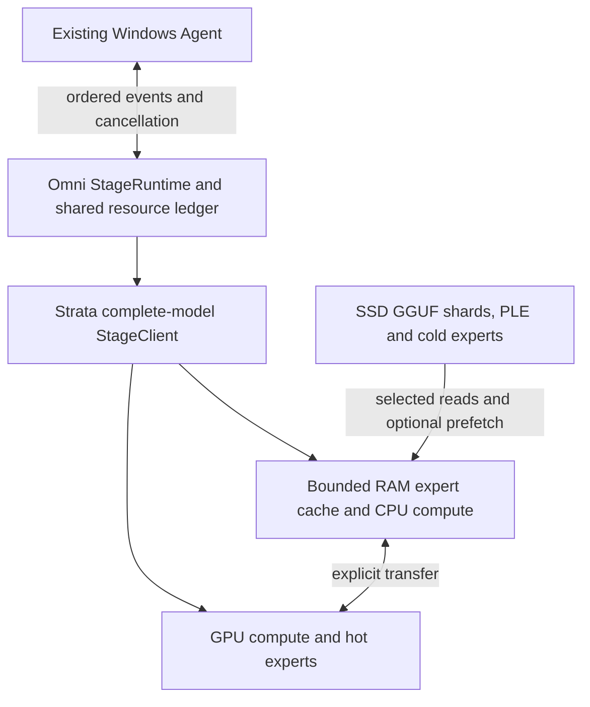

# Strata complete-model experiments through Omni

This integration keeps the autoregressive session inside a complete-model
Strata stage. Omni owns admission, request identity, credits, cancellation and
the process lifetime. Strata owns expert routing, CPU/GPU execution, caches and
SSD reads. No new expert scheduler or inference kernel is introduced here.

The initial registered adapter is `external.strata.text.v1`. Its existence and
offline tests do **not** qualify a model or hardware route. The initial image
path is deliberately refused until its separate artifact and quality work is
complete. AI Hub replay remains distinct from resident Android qualification.



## Pinned replication targets

All targets use Strata commit
`d5ea7133741e67743c0e886bb426c0ce8d69cf6c` (v0.1.40.3). The source model
manifests contain upstream LFS SHA256 values, not hashes calculated from an
unverified local download. Their complete split sets include the PLE table.

| Target config | Pinned GGUF revision | Weight bytes, excluding projector | Intended experiment |
| --- | --- | ---: | --- |
| `configs/strata/ista_q2_0.json` | `ed59f92082b1e93c0e96d60a8b11aab089b52f09` | 66,423,878,624 | RAM experts, SSD-backed PLE |
| `configs/strata/ista_iq3_xxs.json` | same ISTA revision | 75,839,998,528 | Higher-quality RAM candidate |
| `configs/strata/unsloth_ud_q4_k_xl.json` | `38bb39ee97821de2c9009abb7e93950eec396e66` | 111,334,654,784 | Bounded RAM plus SSD expert reads |

Each config also pins its BF16 projector for future image experiments. A
text-only launch may omit that projector from its actual loaded manifest; it
must still declare and verify **every weight shard**. The Q4 first shard is
only 10,946,624 bytes. Checking that file alone misses almost the entire model.

The ISTA GGUF card asserts Apache-2.0 while the base checkpoint uses the Qwen
Community License. The target manifest preserves this unresolved license
provenance; it is not distribution approval. Upstream checkpoint revisions
that the quantizer did not disclose remain explicitly unknown.

The source authors report a Windows RTX 5070 12 GB, 64 GB RAM, AVX-512 CPU
Q4 experiment using a 40 GiB expert RAM budget and MTP. The short six-run
result is approximately 7–8.5 tokens/s, and its 16K prompt prefill is much
slower. This is external evidence, not a result from the current 23.9 GiB
RTX 5090 **Laptop**. See the pinned
[Q4 reproduction instructions](https://github.com/Niko1221/Strata/blob/d5ea7133741e67743c0e886bb426c0ce8d69cf6c/docs/UNSLOTH_Q4.md)
and [runtime release](https://github.com/Niko1221/Strata/releases/tag/v0.1.40.3).
Faster Q2/IQ3 author measurements have different expert residency and must not
be attributed to the Q4 SSD route.

## Prepare and launch

Use the validated native Windows Omni environment for Windows measurements;
a WSL result must keep its Linux/WSL identity. Native Python should start with
UTF-8 mode. Download the exact pinned split files, never a floating `main`.
Verify source files before packing:

```bash
python benchmarks/edge_harness/strata_profile.py verify-target \
  --target benchmarks/edge_harness/configs/strata/unsloth_ud_q4_k_xl.json \
  --model-dir /absolute/path/to/huggingface-layout \
  --out /absolute/path/to/source-verification.json
```

This command includes every file declared by the target, including its
projector. It hashes streaming blocks and rejects missing shards, path escapes,
size differences and hash differences. A failed receipt is not replaced with
locally observed hashes.

Create a launch JSON containing the adapter `backend` object and the ordinary
Omni `resource_budget` (`capacities` and `demands`). Also record
`power_condition` and `cache_condition`; unknown power and cache conditions
remain unknown in the evidence. The backend requires:

- Pinned `runtime_root`, `runtime_revision`, `runtime_manifest`, `python_bin`,
  `python_sha256`, `server_script`, and `engine_file`.
- `artifact_root`, the complete source `artifact_manifest`, `native_file`, and
  `ple_file`; a verified `prepared_model_dir`, `prepared_pack_manifest`, and
  `conversion_manifest` binding source, pack and each conversion.
- `expert_ram_budget_bytes`, `host_overhead_bytes`, `gpu_budget_bytes`,
  `gpu_total_bytes`, `context_tokens`, `max_new_tokens`, and `max_io_bytes`.
- Explicit `spec_tokens`, `ple_prefetch`, `routing_prefetch`, `io_prefetch`,
  and `io_mode`. Start with `spec_tokens=0` and all prefetch switches false.

The source, prepared pack and runtime manifests are separate. Strata's
compatibility pack can convert small tensors; its hashes and conversion list
are part of the route identity. Compare to llama.cpp using the same source
GGUF rather than asserting equivalence to BF16.

`strata_prepare.py` now performs that preparation reproducibly. It verifies all
text weight shards before executing the pinned upstream `tools/iq_pack.py`,
automatically adds `--compat-bf16` for the selected Unsloth Q4 target, and
does not create `experts.bin`. It records both upstream conversion reports,
all pack/tokenizer files, runtime helpers/DLLs/expert profiles, and the supplied
Python executable and installed dependency versions. The unverified future
projector pin is retained separately from the loaded text manifest.
Use `--runtime-provenance` to attach source-archive, release-archive digest and
build receipts. When a Git checkout exists, preparation verifies its actual
HEAD and records dirty changes. For an extracted bundle without Git, a local
hash inventory establishes byte identity only; source/build origin stays
explicitly unverified unless supporting external provenance is supplied.
Even an external release receipt is not an independent reproducible build.

Prepare requires a hardware snapshot JSON and an explicit component-budget
JSON using `WeightTierBudget` field names. Components are declared estimates,
not observed allocations. The host peak must equal expert cache + host
overhead + admitted I/O; GPU steady/loading peak must equal the GPU budget.
PLE resident pages, pinned memory, KV/recurrent state, workspace, transfers,
loading peaks and headroom must be included. Native Windows also requires
available commit capacity and an explicit commit-peak component. Startup
checks availability again; a preparation snapshot is not a future guarantee.

The following PowerShell command illustrates a declared 24 GiB cache, 8 GiB
host overhead and 20 GiB GPU budget. Its component JSON must match those
values, and its capacity arguments must be replaced with the measured
snapshot values. These numbers are not a qualified budget for the laptop:

```powershell
python benchmarks/edge_harness/strata_prepare.py `
  --target benchmarks/edge_harness/configs/strata/ista_q2_0.json `
  --runtime-root C:/Users/zhout/w2/strata-omni/source-pinned `
  --python-bin C:/path/to/native/python.exe `
  --engine-file engine/strata.exe `
  --artifact-root C:/path/to/verified/huggingface-layout `
  --out-pack C:/path/to/new-q2-pack `
  --launch-out C:/path/to/new-q2-launch.json `
  --hardware-snapshot C:/path/to/native-hardware.json `
  --component-budget C:/path/to/components-24gib.json `
  --expert-ram-gib 24 --host-overhead-gib 8 `
  --gpu-total-gib 23.89 --gpu-budget-gib 20 `
  --host-capacity-gib 48 --windows-commit-capacity-gib 48 `
  --context-tokens 4096 --max-new-tokens 512 --kv-type fp16
```

For the SSD route, select `unsloth_ud_q4_k_xl.json` and a new pack directory.
The initial KV baseline is explicitly FP16; INT8 KV is a separate precision
experiment. MTP remains off. `--reuse-bound-pack` permits reuse only when the
outside `.omni-binding.json` agrees with the verified source, runtime and all
pack bytes. Existing unbound or partial packs are refused and preserved.
The launch includes `WeightTierPlan` and uses its exact resource demands;
preparation can produce an explicitly over-budget plan for a reproducible
admission refusal, never an automatic smaller-model fallback.

For MTP, include the exact draft files in the prepared pack manifest and set
`mtp_directory` together with `spec_tokens`. Changing MTP or prefetch creates
a different experiment identity. The pinned runtime's I/O prefetch is limited
to Linux buffered I/O; Windows/direct-I/O combinations must be refused when
unsupported. `io_mode=auto` is requested policy, not proof of the actual mode.

The pinned native server does not accept `--spec 0`. The adapter's public
`spec_tokens=0` baseline loads no MTP draft and uses `--suffix-draft 0
--lookup-chain 0 --spec 2` for the native plain one-token path. The internal
verify window is reported separately. Do not interpret it as MTP enabled.
`gpu_total_bytes` must equal the exact observed NVML total, not a rounded
marketing capacity or the sample GiB value above.

Generate the required expert cache variants without changing machine capacity:

```bash
python benchmarks/edge_harness/strata_profile.py cache-variants \
  --launch /absolute/path/to/launch.json --out /absolute/path/to/new-variants
```

This writes 24/32/40 GiB variants, adjusts the declared host demand by the same
cache delta, and leaves all other settings and capacity ceilings intact. Each
variant still needs admission. The total ledger must cover PLE resident pages,
non-expert weights, KV/recurrent state, MTP, workspace, transfers, load peaks
and headroom. A rejected 40 GiB request must be reported as rejected; a smaller
cache is a separately identified experiment.

## Measure full requests

Run one process and one active request at a time. Do not run different cache
variants concurrently. The standard protocol is three lengths, a separate
warmup for each case, at least 20 measured requests per length, and a separate
1800-second sequential sustained segment:

```bash
python benchmarks/edge_harness/strata_profile.py run \
  --target benchmarks/edge_harness/configs/strata/ista_q2_0.json \
  --launch /absolute/path/to/ram-32gib.json \
  --suite /absolute/path/to/paired-tasks.json \
  --reference /absolute/path/to/reference-outputs.json \
  --out /absolute/path/to/new-run
```

The suite format is `omni-strata-cases-v1`, with `coverage` and `cases`. Each
case contains a unique safe `id`, `length_band` (`short`, `medium`, `long`),
`prompt` (`text`, `max_tokens`, `temperature`), and an optional task check:

```json
{
  "schema": "omni-strata-cases-v1",
  "coverage": "named bilingual task set with independently reviewed references",
  "cases": [
    {
      "id": "short-code",
      "length_band": "short",
      "prompt": {"text": "Return only the integer: 6 * 6", "max_tokens": 128, "temperature": 0},
      "quality": {"kind": "exact_text", "expected": "36"}
    }
  ]
}
```

A full run also needs medium and long cases. `json_equal` compares parsed JSON;
`regex` uses a full-string match. Reference JSON maps case IDs to complete
`output_text`, optional `output_sha256` and actual `output_token_ids`. Reference
agreement and task checks are separate fields: different quantized checkpoints
need task-quality assessment, not automatic exact-token equivalence.

Without a custom suite, the harness runs a small bilingual retrieval smoke
task. It does not qualify browser actions, tools, memory, images or long
reasoning. Custom model tasks cannot replace full Agent tests through the
existing permission-controlled Agent loop.

For instrumentation only, add `--length-band short --repeats 1
--sustained-seconds 0`. Such a run cannot pass the full timing protocol.
`--batch-size` and `--concurrency` accept only 1. A token prefill chunk is not
an extra active request.

## Evidence, recovery and interpretation

- `run_manifest.json` binds the entire target, launch, suite, references and
  protocol to an immutable identity. Startup timing is separate from request
  latency and is not described as cold disk without evidence.
- `requests/*.json` are atomic durable raw records with complete inputs and
  outputs, hashes, credited chunk arrivals, terminal event identity, actual
  token counts when available, reference results and backend metrics.
- `report.json` contains nearest-rank p50/p95 and the underlying latency
  arrays. Text chunks can contain multiple tokens; missing token timestamps,
  cache hits, physical SSD reads and I/O waits remain null, never zero.
- `telemetry.jsonl` samples host and all visible NVIDIA GPUs. Whole-system
  disk reads include other processes/devices; they are not attributable SSD
  weight reads. Sampled memory peaks can miss transients. GPU board power is
  not whole-device power, and WSL RAM is not an additional RAM pool.
- Cancellation drains and unloads this whole-model route. All reloads share
  one resource ledger. A retained or quarantined claim refuses recovery even
  when a new process would appear to have spare capacity. Only a proven drain
  allows a separate fresh-route recovery request. A request that finishes
  before cancellation is explicitly inconclusive. Request ACK normally
  releases request state while retaining weights.

Resume with the exact same command plus `--resume`. Successful measured
requests are not repeated. Failed attempts are retained and retries get new
request IDs. Each newly loaded route gets new warmups. A partially completed
30-minute thermal run restarts as a new continuous segment: downtime and
separate partial segments cannot be added into a thermal pass. Resume repeats
an interrupted whole request; it does not claim mid-token state restoration.
Persisted quarantine/retained claims refuse resume. An abruptly interrupted
real run with live last-known claims and no final drain proof also refuses
reload; a fresh Python process does not erase an older worker's memory use.

Recompute a summary directly from durable samples:

```bash
python benchmarks/edge_harness/strata_profile.py summarize /absolute/path/to/run
```

`status=completed` means the experiment ran to completion. It is not release
qualification. Promotion still requires reference/task quality, complete
declared modalities, truthful executed placement, admission and release,
state isolation, stability, and a same-input whole-request baseline comparison.
Real SSD cold reads, OS file-cache hits, MTP and prefetch ablations must be
separate records. Do not clear global caches, change pagefiles or alter power
settings silently. Preserve failed experiments and their exact configurations.
