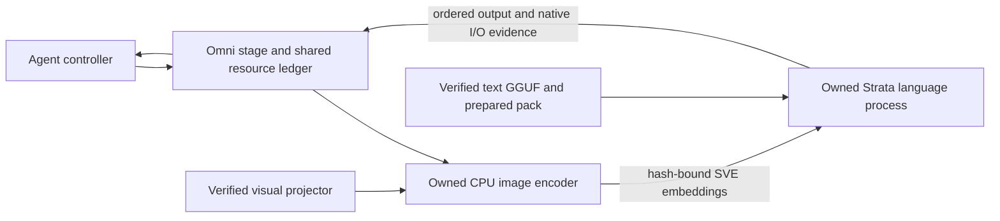

# Experimental Strata image stage

`external.strata.multimodal.v1` extends the existing complete-model Strata
stage. It uses the same Omni `StageRuntime`, shared resource lease, bounded
stream, acknowledgements, cancellation and quarantine path as the text stage.
The host validates and transports PNG bytes; neural image encoding and language
generation run in owned native processes.



## Route identity and admission

The image route is distinct from `external.strata.text.v1`. Renaming a text
backend or inheriting a text qualification does not grant image capability.
The strict image validator binds the checkpoint, every source shard, prepared
pack and conversions, full runtime, native build and PE closure, Python/Pillow
environment, visual projector, bootstrap, adapter and image bounds.

The initial encoder is CPU only. CUDA image encoding and implicit CPU fallback
refuse until their physical execution identity can be verified. Language-side
CPU/CUDA configuration and CPU encoder observations remain separate; neither
proves placement of every model operator.

Image registration adds encoder workspace and scratch to the existing text
workspace, loading peak and Windows commit claim. Increasing the transport
limit is charged once to transfer/loading/commit, not again to overhead.
The visual projector is charged to SSD storage; the replacement runtime has
already been charged by text registration. File cache still consumes RAM.
Inherited ceilings are never raised, and registration snapshots do not replace
the fresh startup probes and shared resource lease.

## Registration sequence

Keep the original prepared launch, preparation receipt and pack binding
immutable. Use new, exclusive destinations for each registration attempt.

1. Call `benchmarks.edge_harness.strata_runtime` with the **original prepared
   text launch** and the complete replacement runtime manifest. Copy only the
   native observation descriptor; recompute its identity against the current
   trusted bootstrap and I/O adapter. A previously derived observed launch is
   not an original preparation.
2. Create an `omni-strata-image-route-v1` descriptor with the exact typed
   projector manifest and typed text artifact digest from that new registration.
   The projector file role must be exactly `vision_projector`.
   The descriptor specifies encoder executable/build proof, embedding width,
   CPU execution, no fallback, PNG/pixel/token bounds and workspace/scratch.
3. Call `benchmarks.edge_harness.strata_vision_register` with the new text launch,
   its exact `.registration.json`, image descriptor, distinct route ID, explicit
   transport limit and new image launch destination. It replays the public text
   registrar, verifies all files and probes current capacity without loading a
   neural model.

For the first local Q2 experiment, provisional limits are a 4 MiB PNG,
4,194,304 pixels, 1,536 image tokens, width 2,560, eight CPU encoder threads,
3 GiB encoder workspace, 64 MiB scratch and 8 MiB transport. These are declared
admission bounds, not measured peaks. The original 4K context, output cap,
precision, 8 GiB expert cache and disabled MTP/prefetch remain explicit.

```text
python -B -X utf8 -m benchmarks.edge_harness.strata_vision_register --text-launch TEXT_LAUNCH --text-registration TEXT_REGISTRATION --image-route IMAGE_DESCRIPTOR --route-id DISTINCT_IMAGE_ROUTE --max-io-bytes 8388608 --launch-out NEW_IMAGE_LAUNCH
```

## Requests, proof and cancellation

Each single-image request binds PNG hash and dimensions to the exact encoder
process generation and `ENC` sequence. Its persisted `SVE` shape and hash must
match the embedding consumed by `GENI` in the owned language process. The
language terminal, request ID, epoch and complete native I/O observations must
agree before the Agent treats provisional text deltas as a completed result.
Duplicate, reordered and lower unseen epochs refuse.

Encoder and language processes have distinct PID/creation identities and
loaded-module audits. Cancellation drains both roles and their transfers before
state and the shared lease can be released. Uncertain retirement quarantines
the stage; recovery requires a fresh generation. Language I/O counters exclude
image encoder work, and logical/direct-transfer bytes are not physical SSD I/O.

## Qualification boundary

The [CPU build record](results/strata_20261008/native_cpu_vision_build.json)
proves compilation and static provenance only. The subsequent
[native Windows image lifecycle](results/strata_20261008/native_cpu_image_lifecycle.json)
passed independent stopped-run review with the ISTA GSQ-RCO Q2_0 checkpoint and
BF16 projector. At batch=1/concurrency=1, 4K context and MTP off on the RTX 5090
Laptop, two initial real-application screenshot tasks and one fresh-generation
recovery request completed in **28.09 / 28.49 / 27.06 s**. These are individual
full-chain samples, excluding separate verification/startup spans of **202.28 /
191.75 s**, which include full hashing and initialization. Each completed encode
of the 1040×760 PNG produced 792 image tokens with matching persisted SVE bytes.
Observed encoder-phase cancellation drained in **2.31 s** and retired both exact
roles before recovery. All 27 closed files, native sequence/QPC/counter bindings,
selected loaded modules, final getters, source identities and shared ledger
were independently checked. Language I/O excludes encoder/loading; WDDM local
and nonlocal peaks remain separate, and power has only pre/post snapshots. This
record grants no Agent, broad image quality, percentile performance, sustained
stability, aggregate hard-cap or default/release qualification. The Agent bridge requires explicit experimental selection and strict
image proof; formal profile/default promotion remains refused pending a reviewed
image task suite. Text, image, performance, total-memory and physical-SSD claims
remain separate in the [rolling status](EDGE_ENGINE_STATUS.md).
