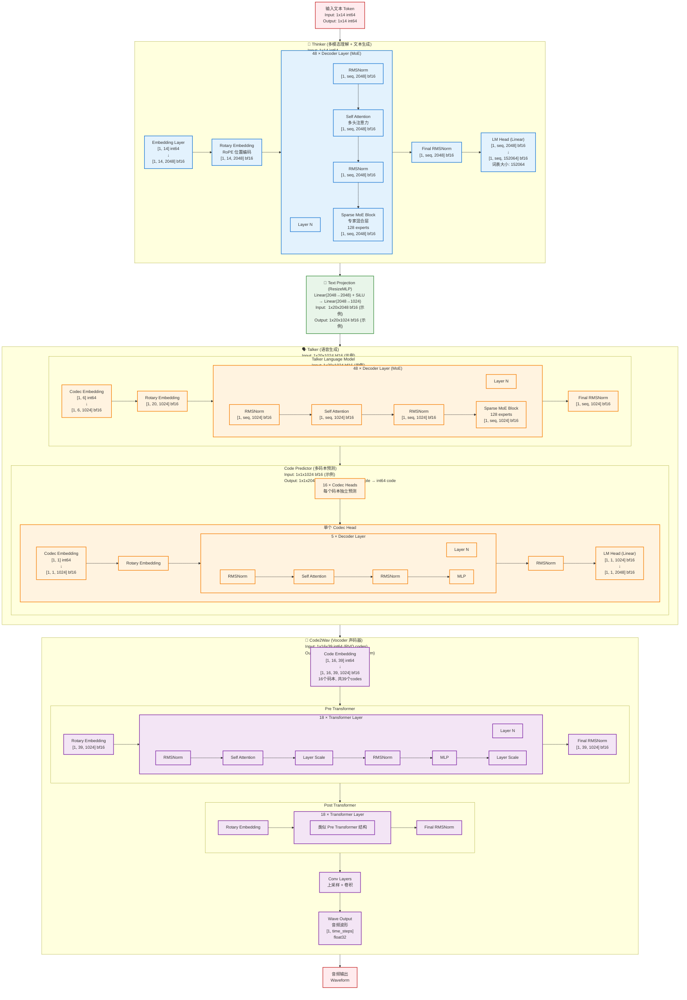

# Qwen3 Omni 30B 模型架构

完整的 Qwen3 Omni 30B 模型架构,展示数据流、形状和类型。

## 完整架构流程图



## 模型详细规格

### 1. Thinker (思维模块)
- **功能**: 多模态理解和文本生成
- **层数**: 48 层 Transformer Decoder
- **隐藏维度**: 2048
- **MoE 配置**: 
  - 每层 128 个专家
  - 稀疏激活(只激活部分专家)
- **输入**: 文本 token (int64)
- **输出**: 文本logits [vocab_size=152064]
- **数据类型**: bfloat16

**每层结构**:
```
输入 → RMSNorm → Self-Attention → 残差连接
     ↓
     → RMSNorm → Sparse MoE Block → 残差连接 → 输出
```

### 2. Text Projection (桥接层)
- **功能**: 将 Thinker 的 2048 维降到 Talker 的 1024 维
- **结构**: 
  - Linear(2048 → 2048)
  - SiLU 激活
  - Linear(2048 → 1024)
- **数据类型**: bfloat16

### 3. Talker (语音生成模块)

#### 3.1 Talker Language Model
- **层数**: 48 层 Transformer Decoder
- **隐藏维度**: 1024
- **MoE 配置**: 每层 128 个专家
- **输入**: 来自 Thinker 的投影 + Codec embeddings
- **输出**: 中间表示用于 Code Predictor

#### 3.2 Code Predictor (码本预测器)
- **功能**: 多码本预测(Multi-Token Prediction)
- **码本数量**: 16 个独立码本
- **每个码本**:
  - 5 层 Transformer Decoder
  - 隐藏维度: 1024
  - 输出: 2048 个 codes
- **数据类型**: bfloat16

### 4. Code2Wav (声码器)
- **功能**: 将 RVQ codes 转换为音频波形
- **输入**: 16 个码本 × 39 个 codes/帧
- **结构**:
  - **Pre Transformer**: 18 层
    - RMSNorm + Self-Attention + Layer Scale
    - RMSNorm + MLP + Layer Scale
  - **Post Transformer**: 18 层(相同结构)
  - **Wave Conv**: 上采样卷积层
- **输出**: 音频波形 (float32)
- **数据类型**: bfloat16 (transformer), float32 (output)

## 关键特性

### MoE (Mixture of Experts)
- **专家数量**: 128 个专家/层
- **激活策略**: 稀疏激活
- **位置**: Thinker 和 Talker 的每个 MLP 层

### 注意力机制
- **类型**: Multi-Head Self-Attention
- **位置编码**: RoPE (Rotary Position Embedding)
- **KV Cache**: 支持增量解码

### 归一化
- **类型**: RMSNorm (Root Mean Square Layer Normalization)
- **位置**: 每个 attention/MLP 之前

### 数据类型优化
- **主要计算**: bfloat16 (降低显存,加速计算)
- **输入 tokens**: int64
- **音频输出**: float32 (保证质量)

## 数据流总览

```
文本输入 (int64)
    ↓
Thinker Embedding (2048-dim, bf16)
    ↓
48 × Decoder Layer (MoE)
    ↓
LM Head → 文本 logits
    ↓
Text Projection (2048→1024)
    ↓
Talker LM (48 × Decoder Layer, MoE)
    ↓
Code Predictor (16 × 5-layer, 预测 RVQ codes)
    ↓
Code2Wav Pre-Transformer (18层)
    ↓
Code2Wav Post-Transformer (18层)
    ↓
Wave Conv (上采样)
    ↓
音频波形输出 (float32)
```

## 模型规模

- **总参数**: ~30B
- **Thinker**: ~20B (48层 × 2048-dim MoE)
- **Talker**: ~8B (48层 × 1024-dim MoE + Code Predictor)
- **Code2Wav**: ~2B (36层 transformer + conv)

## 主要优化

1. **MoE 架构**: 大容量参数,实际激活参数较少
2. **bfloat16**: 降低显存占用,加速训练和推理
3. **多阶段设计**: Thinker→Talker→Code2Wav 流水线
4. **多码本预测**: 16个码本并行预测,提高音频质量

---

*生成时间: 2026-01-09*
*基于 Qwen3-Omni-30B-A3B-Thinking 模型*
