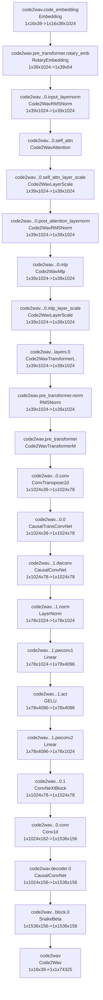

# Qwen3 Omni Model Structure - Code2Wav (Vocoder)

```mermaid
flowchart TD
    code2wav_code_embedding["code2wav.code_embedding\nEmbedding\n1x16x39->1x16x39x1024"]
    code2wav_pre_transformer_rotary_emb["code2wav.pre_transformer.rotary_emb\nRotaryEmbedding\n1x39x1024->1x39x64"]
    code2wav_code_embedding --> code2wav_pre_transformer_rotary_emb
    code2wav_pre_transformer_layers_0_input_layernorm["code2wav...0.input_layernorm\nCode2WavRMSNorm\n1x39x1024->1x39x1024"]
    code2wav_pre_transformer_rotary_emb --> code2wav_pre_transformer_layers_0_input_layernorm
    code2wav_pre_transformer_layers_0_self_attn["code2wav...0.self_attn\nCode2WavAttention"]
    code2wav_pre_transformer_layers_0_input_layernorm --> code2wav_pre_transformer_layers_0_self_attn
    code2wav_pre_transformer_layers_0_self_attn_layer_scale["code2wav...0.self_attn_layer_scale\nCode2WavLayerScale\n1x39x1024->1x39x1024"]
    code2wav_pre_transformer_layers_0_self_attn --> code2wav_pre_transformer_layers_0_self_attn_layer_scale
    code2wav_pre_transformer_layers_0_post_attention_layernorm["code2wav...0.post_attention_layernorm\nCode2WavRMSNorm\n1x39x1024->1x39x1024"]
    code2wav_pre_transformer_layers_0_self_attn_layer_scale --> code2wav_pre_transformer_layers_0_post_attention_layernorm
    code2wav_pre_transformer_layers_0_mlp["code2wav...0.mlp\nCode2WavMlp\n1x39x1024->1x39x1024"]
    code2wav_pre_transformer_layers_0_post_attention_layernorm --> code2wav_pre_transformer_layers_0_mlp
    code2wav_pre_transformer_layers_0_mlp_layer_scale["code2wav...0.mlp_layer_scale\nCode2WavLayerScale\n1x39x1024->1x39x1024"]
    code2wav_pre_transformer_layers_0_mlp --> code2wav_pre_transformer_layers_0_mlp_layer_scale
    code2wav_pre_transformer_layers_0["code2wav...layers.0\nCode2WavTransformerL\n1x39x1024->1x39x1024"]
    code2wav_pre_transformer_layers_0_mlp_layer_scale --> code2wav_pre_transformer_layers_0
    code2wav_pre_transformer_norm["code2wav.pre_transformer.norm\nRMSNorm\n1x39x1024->1x39x1024"]
    code2wav_pre_transformer_layers_0 --> code2wav_pre_transformer_norm
    code2wav_pre_transformer["code2wav.pre_transformer\nCode2WavTransformerM"]
    code2wav_pre_transformer_norm --> code2wav_pre_transformer
    code2wav_upsample_0_0_conv["code2wav...0.conv\nConvTranspose1d\n1x1024x39->1x1024x78"]
    code2wav_pre_transformer --> code2wav_upsample_0_0_conv
    code2wav_upsample_0_0["code2wav...0.0\nCausalTransConvNet\n1x1024x39->1x1024x78"]
    code2wav_upsample_0_0_conv --> code2wav_upsample_0_0
    code2wav_upsample_0_1_dwconv["code2wav...1.dwconv\nCausalConvNet\n1x1024x78->1x1024x78"]
    code2wav_upsample_0_0 --> code2wav_upsample_0_1_dwconv
    code2wav_upsample_0_1_norm["code2wav...1.norm\nLayerNorm\n1x78x1024->1x78x1024"]
    code2wav_upsample_0_1_dwconv --> code2wav_upsample_0_1_norm
    code2wav_upsample_0_1_pwconv1["code2wav...1.pwconv1\nLinear\n1x78x1024->1x78x4096"]
    code2wav_upsample_0_1_norm --> code2wav_upsample_0_1_pwconv1
    code2wav_upsample_0_1_act["code2wav...1.act\nGELU\n1x78x4096->1x78x4096"]
    code2wav_upsample_0_1_pwconv1 --> code2wav_upsample_0_1_act
    code2wav_upsample_0_1_pwconv2["code2wav...1.pwconv2\nLinear\n1x78x4096->1x78x1024"]
    code2wav_upsample_0_1_act --> code2wav_upsample_0_1_pwconv2
    code2wav_upsample_0_1["code2wav...0.1\nConvNeXtBlock\n1x1024x78->1x1024x78"]
    code2wav_upsample_0_1_pwconv2 --> code2wav_upsample_0_1
    code2wav_decoder_0_conv["code2wav...0.conv\nConv1d\n1x1024x162->1x1536x156"]
    code2wav_upsample_0_1 --> code2wav_decoder_0_conv
    code2wav_decoder_0["code2wav.decoder.0\nCausalConvNet\n1x1024x156->1x1536x156"]
    code2wav_decoder_0_conv --> code2wav_decoder_0
    code2wav_decoder_1_block_0["code2wav...block.0\nSnakeBeta\n1x1536x156->1x1536x156"]
    code2wav_decoder_0 --> code2wav_decoder_1_block_0
    code2wav["code2wav\nCode2Wav\n1x16x39->1x1x74325"]
    code2wav_decoder_1_block_0 --> code2wav
```
