# Qwen3 Omni 30B 高层架构

简洁的高层架构图,重点展示主要组件和数据流。

## 高层架构图

```mermaid
flowchart LR
    %% Input/Output
    Input["📝 文本输入<br/>Input:  1x14 int64<br/>Output: 1x14 int64"]
    Output["🔊 音频输出<br/>Input:  1xT_audio float32<br/>Output: 1xT_audio float32"]
    
    %% Main Components
    subgraph Stage1["阶段 1: 多模态理解"]
        Thinker["🧠 Thinker<br/>━━━━━━━━━━<br/>48层 MoE Transformer<br/>Hidden: 2048<br/>Experts: 128/layer<br/>━━━━━━━━━━<br/>Input:  1x14 int64<br/>Output1: 1x14x2048 bf16 (hidden)<br/>Output2: 1x14x152064 bf16 (logits)"]
    end
    
    subgraph Bridge["阶段 1.5: 维度转换"]
        Proj["🔗 Projection (ResizeMLP)<br/>━━━━━━━━━━<br/>Linear(2048→2048) + SiLU + Linear(2048→1024)<br/>━━━━━━━━━━<br/>Input:  1x20x2048 bf16 (示例)<br/>Output: 1x20x1024 bf16 (示例)"]
    end
    
    subgraph Stage2["阶段 2: 语音生成"]
        Talker["🗣️ Talker LM<br/>━━━━━━━━━━<br/>48层 MoE Transformer<br/>Hidden: 1024<br/>Experts: 128/layer<br/>━━━━━━━━━━<br/>Input:  1x20x1024 bf16 (示例)<br/>Output: 1x20x1024 bf16 (示例)"]
        
        CodePred["📊 Code Predictor<br/>━━━━━━━━━━<br/>16个独立码本<br/>每个: 5层 Transformer<br/>Hidden: 1024<br/>━━━━━━━━━━<br/>Input:  1x1x1024 bf16 (示例)<br/>Output: 1x16x39 int64 (RVQ codes, 示例)"]
    end
    
    subgraph Stage3["阶段 3: 音频合成"]
        Code2Wav["🎵 Code2Wav<br/>━━━━━━━━━━<br/>Pre-Trans: 18层<br/>Post-Trans: 18层<br/>Wave Conv: 上采样<br/>━━━━━━━━━━<br/>Input:  1x16x39 int64 (RVQ codes)<br/>Output: 1xT_audio float32 (waveform)"]
    end
    
    %% Connections
    Input --> Thinker
    Thinker --> Proj
    Proj --> Talker
    Talker --> CodePred
    CodePred --> Code2Wav
    Code2Wav --> Output
    
    %% Styling
    classDef stage1 fill:#e3f2fd,stroke:#1976d2,stroke-width:3px
    classDef bridge fill:#e8f5e9,stroke:#388e3c,stroke-width:3px
    classDef stage2 fill:#fff3e0,stroke:#f57c00,stroke-width:3px
    classDef stage3 fill:#f3e5f5,stroke:#7b1fa2,stroke-width:3px
    classDef io fill:#ffebee,stroke:#c62828,stroke-width:3px
    
    class Thinker stage1
    class Proj bridge
    class Talker,CodePred stage2
    class Code2Wav stage3
    class Input,Output io
```



## 核心组件详解

### 1️⃣ Thinker (思维模块)
```
功能: 理解输入文本/多模态内容
架构: 48层 MoE Transformer Decoder
参数: ~20B
规格:
  - Hidden Size: 2048
  - MoE: 128 experts/layer
  - Vocab Size: 152,064
  - Dtype: bfloat16
```

**关键操作**:
- Token Embedding
- RoPE 位置编码
- 48 × (RMSNorm → Self-Attention → RMSNorm → MoE)
- LM Head 输出

### 2️⃣ Text Projection (投影层)
```
功能: 降维适配
架构: 2层 MLP
参数: ~10M
规格:
  - Input: 2048
  - Output: 1024
  - Activation: SiLU
  - Dtype: bfloat16
```

### 3️⃣ Talker (语音生成模块)
```
功能: 将文本表示转为音频码本
架构: 48层 MoE + 16个码本预测器
参数: ~8B
规格:
  - LM Hidden: 1024
  - MoE: 128 experts/layer
  - Code Predictor: 16×(5层)
  - Dtype: bfloat16
```

**关键操作**:
- Talker LM: 处理文本投影 + codec tokens
- Code Predictor: 16个码本并行预测 RVQ codes

### 4️⃣ Code2Wav (声码器)
```
功能: RVQ codes → 音频波形
架构: 36层 Transformer + 卷积
参数: ~2B
规格:
  - Pre-Transformer: 18层
  - Post-Transformer: 18层
  - Wave Conv: 上采样卷积
  - Input: [B,16,39] int64
  - Output: [B,time] float32
```

## 数据形状流转

```
输入文本
  [batch, seq_len] int64
       ↓
Thinker Embedding
  [batch, seq_len, 2048] bfloat16
       ↓
Thinker Layers (48×)
  [batch, seq_len, 2048] bfloat16
       ↓
Thinker LM Head
  [batch, seq_len, 152064] bfloat16
       ↓
Text Projection
  [batch, seq_len, 1024] bfloat16
       ↓
Talker LM (48×)
  [batch, seq_len, 1024] bfloat16
       ↓
Code Predictor (16×)
  [batch, 16, frame_len] int64  (RVQ codes)
       ↓
Code2Wav Embedding
  [batch, 16, frame_len, 1024] bfloat16
       ↓
Pre-Transformer (18×)
  [batch, frame_len, 1024] bfloat16
       ↓
Post-Transformer (18×)
  [batch, frame_len, 1024] bfloat16
       ↓
Wave Conv (上采样)
  [batch, time_steps] float32
       ↓
音频输出
```

## 关键技术

### 🎯 MoE (Mixture of Experts)
- **专家数量**: 每层 128 个专家
- **稀疏激活**: 仅激活 top-k 专家
- **优势**: 大容量参数,低实际计算量

### 🔄 RoPE (Rotary Position Embedding)
- **用途**: 位置编码
- **优势**: 支持外推,长序列性能好

### 📊 RVQ (Residual Vector Quantization)
- **码本数量**: 16 个
- **每帧**: 39 个 codes
- **优势**: 高质量音频压缩

### 🎨 bfloat16 优化
- **显存**: 比 float32 省一半
- **速度**: 硬件加速支持好
- **精度**: 保持训练稳定性

## 模型特点

| 特性 | Thinker | Talker | Code2Wav |
|-----|---------|--------|----------|
| **层数** | 48 | 48+16×5 | 36 |
| **隐藏维度** | 2048 | 1024 | 1024 |
| **MoE** | ✅ 128专家 | ✅ 128专家 | ❌ |
| **参数量** | ~20B | ~8B | ~2B |
| **数据类型** | bfloat16 | bfloat16 | bf16→f32 |
| **主要任务** | 文本理解 | 码本预测 | 波形生成 |

## 处理流程示例

### 输入
```python
text = "你好,世界"
tokens = tokenizer(text)  # [1, 14]
```

### Thinker 处理
```python
embedded = embed(tokens)           # [1, 14, 2048]
hidden = thinker_layers(embedded)  # [1, 14, 2048]
logits = lm_head(hidden)           # [1, 14, 152064]
```

### Talker 处理
```python
projected = projection(hidden)         # [1, 14, 1024]
talker_out = talker_layers(projected)  # [1, 14, 1024]
codes = code_predictor(talker_out)     # [1, 16, T]
```

### Code2Wav 处理
```python
code_emb = code_embedding(codes)       # [1, 16, T, 1024]
pre_out = pre_transformer(code_emb)    # [1, T, 1024]
post_out = post_transformer(pre_out)   # [1, T, 1024]
wave = wave_conv(post_out)             # [1, audio_len]
```

## 性能特点

### ⚡ 推理速度
- **Prefill**: 处理输入序列 (并行)
- **Decode**: 自回归生成 (串行)
- **MoE**: 稀疏激活降低计算

### 💾 显存占用
- **模型参数**: ~30GB (bf16)
- **KV Cache**: 动态增长
- **激活值**: batch × seq × hidden

### 🎵 音频质量
- **16 码本**: 更丰富的音频表示
- **RVQ**: 渐进式细化
- **24kHz**: 高采样率输出

---

*Qwen3-Omni-30B-A3B-Thinking*
*2026-01-09*
