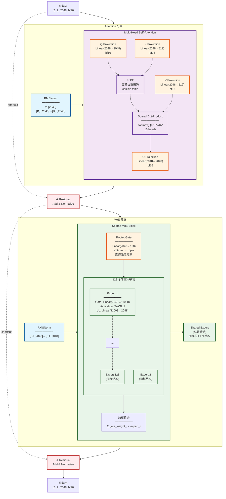
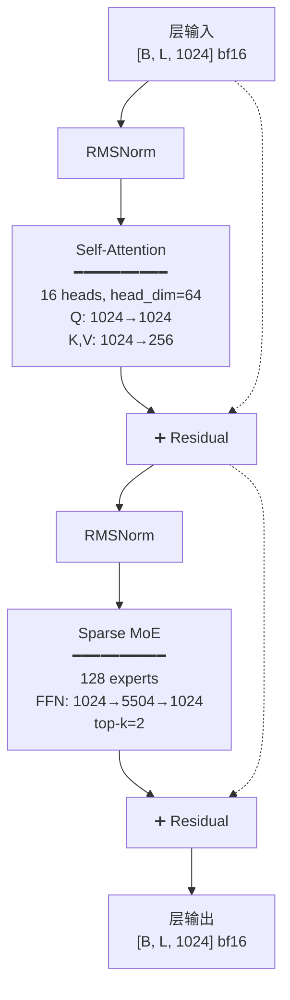
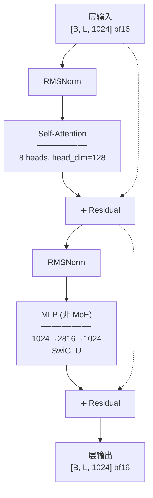
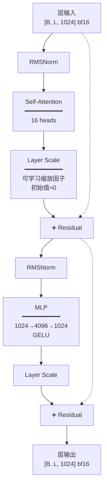

# Qwen3 Omni 层级细节

详细展示各组件的内部结构和操作。

## Thinker Decoder Layer 详细结构



## 详细操作说明

### 1. RMSNorm (Root Mean Square Normalization)

```python
def rms_norm(x, weight, eps=1e-6):
    """
    x: [B, L, D]
    weight: [D]
    """
    variance = x.pow(2).mean(-1, keepdim=True)
    x = x * torch.rsqrt(variance + eps)
    return weight * x
```

**输入/输出**:
- 输入: `[batch, seq_len, hidden]` bfloat16
- 输出: `[batch, seq_len, hidden]` bfloat16

### 2. Self-Attention (自注意力)

```python
def self_attention(x, W_q, W_k, W_v, W_o, rope):
    """
    x: [B, L, D]
    W_q: [D, D], W_k: [D, D_kv], W_v: [D, D_kv], W_o: [D, D]
    """
    Q = x @ W_q  # [B, L, D]
    K = x @ W_k  # [B, L, D_kv]
    V = x @ W_v  # [B, L, D_kv]
    
    # Apply RoPE
    Q, K = rope(Q, K)
    
    # Multi-head attention
    Q = Q.view(B, L, num_heads, head_dim).transpose(1, 2)  # [B, H, L, D/H]
    K = K.view(B, L, num_kv_heads, head_dim).transpose(1, 2)
    V = V.view(B, L, num_kv_heads, head_dim).transpose(1, 2)
    
    # Grouped Query Attention (GQA)
    attn = softmax(Q @ K.T / sqrt(head_dim))  # [B, H, L, L]
    out = attn @ V  # [B, H, L, D/H]
    
    # Concatenate heads
    out = out.transpose(1, 2).contiguous().view(B, L, D)
    return out @ W_o
```

**参数**:
- Thinker: 16 heads, head_dim=128, GQA ratio=4
- Talker: 16 heads, head_dim=64, GQA ratio=4

**形状**:
- Q: `[B, L, 2048]` → `[B, 16, L, 128]`
- K,V: `[B, L, 512]` → `[B, 4, L, 128]`

### 3. RoPE (Rotary Position Embedding)

```python
def apply_rotary_emb(q, k, cos, sin):
    """
    Rotate half of the dimensions
    """
    q_rot = rotate_half(q)
    k_rot = rotate_half(k)
    
    q_out = q * cos + q_rot * sin
    k_out = k * cos + k_rot * sin
    return q_out, k_out

def rotate_half(x):
    """Rotate half of hidden dims"""
    x1, x2 = x[..., :x.shape[-1]//2], x[..., x.shape[-1]//2:]
    return torch.cat((-x2, x1), dim=-1)
```

### 4. Sparse MoE (稀疏专家混合)

```python
def sparse_moe(x, gate, experts, k=2):
    """
    x: [B, L, D]
    gate: [D, num_experts]
    experts: list of FFN modules
    k: top-k experts to activate
    """
    # Router
    router_logits = x @ gate  # [B, L, num_experts]
    router_probs = softmax(router_logits, dim=-1)
    
    # Select top-k experts
    top_k_probs, top_k_indices = torch.topk(router_probs, k, dim=-1)
    # [B, L, k]
    
    # Normalize weights
    top_k_probs = top_k_probs / top_k_probs.sum(dim=-1, keepdim=True)
    
    # Expert computation (only compute selected experts)
    output = torch.zeros_like(x)
    for i in range(k):
        expert_idx = top_k_indices[:, :, i]  # [B, L]
        expert_weight = top_k_probs[:, :, i:i+1]  # [B, L, 1]
        
        # Batch expert calls
        expert_out = experts[expert_idx](x)  # [B, L, D]
        output += expert_weight * expert_out
    
    return output
```

**Thinker MoE 配置**:
- 专家数: 128
- Top-k: 2 (每次激活2个专家)
- Shared expert: 1 (总是激活)
- Expert FFN: 2048 → 11008 → 2048

**Talker MoE 配置**:
- 专家数: 128
- Top-k: 2
- Shared expert: 1
- Expert FFN: 1024 → 5504 → 1024

### 5. FFN (Feed-Forward Network) 在专家中

```python
def ffn_expert(x, W_gate, W_up, W_down):
    """
    SwiGLU activation: swish(xW_gate) ⊙ (xW_up)
    
    x: [B, L, D]
    W_gate: [D, D_ff]
    W_up: [D, D_ff]
    W_down: [D_ff, D]
    """
    gate = F.silu(x @ W_gate)  # [B, L, D_ff]
    up = x @ W_up              # [B, L, D_ff]
    return (gate * up) @ W_down  # [B, L, D]
```

## Talker Decoder Layer

与 Thinker 类似,但有以下差异:



**关键差异**:
- Hidden size: 2048 → 1024
- Head dim: 128 → 64
- FFN intermediate: 11008 → 5504

## Code Predictor Layer



**关键特点**:
- **无 MoE**: 使用普通 MLP
- **更小的网络**: 5 层 vs 48 层
- **独立码本**: 16 个预测器并行

## Code2Wav Transformer Layer



**关键特点**:
- **Layer Scale**: 稳定深层网络训练
- **无 MoE**: 所有层都是密集 MLP
- **GELU 激活**: 代替 SwiGLU

## 计算复杂度分析

### Thinker Decoder Layer

| 操作 | 参数量 | 计算量 (FLOPs) |
|------|--------|----------------|
| RMSNorm × 2 | 2×2048 | 忽略不计 |
| Q Projection | 2048×2048 | 2BLD² |
| K Projection | 2048×512 | 0.5BLD² |
| V Projection | 2048×512 | 0.5BLD² |
| Attention | - | 2BL²D |
| O Projection | 2048×2048 | 2BLD² |
| MoE Router | 2048×128 | 忽略不计 |
| Expert (×2激活) | 2×(2048×11008×2) | 8BLD_ff |
| Shared Expert | 2048×11008×2 | 4BLD_ff |
| **总计** | ~47M/layer | ~12BLD_ff |

其中:
- B = batch size
- L = sequence length  
- D = 2048
- D_ff = 11008

### 总参数量估算

```
Thinker: 48 layers × 47M ≈ 2.3B (骨干)
         + Embedding (152K × 2048) ≈ 311M
         + MoE experts (128 × 48 × 90M) ≈ 18B
         = ~20.6B

Talker:  48 layers × 12M ≈ 576M (骨干)
         + MoE experts (128 × 48 × 22M) ≈ 7B
         + Code Predictor (16 × 5 × 3M) ≈ 240M
         = ~7.8B

Code2Wav: 36 layers × 13M ≈ 470M
          + Conv layers ≈ 30M
          = ~500M

Total: 20.6B + 7.8B + 0.5B ≈ 29B
```

## 数据类型与精度

### bfloat16 格式
```
符号位(1) | 指数位(8) | 尾数位(7)
    ↓          ↓           ↓
   [0]    [11111110]   [1111111]

表示范围: ±3.4×10^38 (同 float32)
精度: ~3位十进制 (vs float32的7位)
```

**优势**:
- ✅ 显存占用减半
- ✅ 硬件加速(TPU/GPU原生支持)
- ✅ 动态范围大(指数位同 float32)
- ✅ 训练稳定(不易溢出)

**劣势**:
- ❌ 精度降低(7位尾数 vs 23位)
- ❌ 小数表示不精确

---

*详细层级分析 - Qwen3 Omni 30B*
