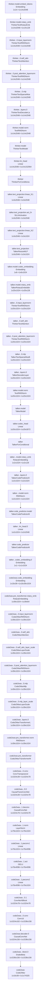

# Qwen3 Omni Model Structure - Complete Overview

```mermaid
flowchart TD
    thinker_model_embed_tokens["thinker.model.embed_tokens\nEmbedding\n1x14->1x14x2048"]
    thinker_model_rotary_emb["thinker.model.rotary_emb\nThinkerTextRotaryEmb\n1x14x2048->1x14x128"]
    thinker_model_embed_tokens --> thinker_model_rotary_emb
    thinker_model_layers_0_input_layernorm["thinker...0.input_layernorm\nThinkerTextRMSNorm\n1x14x2048->1x14x2048"]
    thinker_model_rotary_emb --> thinker_model_layers_0_input_layernorm
    thinker_model_layers_0_self_attn["thinker...0.self_attn\nThinkerTextAttention"]
    thinker_model_layers_0_input_layernorm --> thinker_model_layers_0_self_attn
    thinker_model_layers_0_post_attention_layernorm["thinker...0.post_attention_layernorm\nThinkerTextRMSNorm\n1x14x2048->1x14x2048"]
    thinker_model_layers_0_self_attn --> thinker_model_layers_0_post_attention_layernorm
    thinker_model_layers_0_mlp["thinker...0.mlp\nThinkerTextSparseMoe\n1x14x2048->1x14x2048"]
    thinker_model_layers_0_post_attention_layernorm --> thinker_model_layers_0_mlp
    thinker_model_layers_0["thinker...layers.0\nThinkerTextDecoderLa\n1x14x2048->1x14x2048"]
    thinker_model_layers_0_mlp --> thinker_model_layers_0
    thinker_model_norm["thinker.model.norm\nTextRMSNorm\n1x14x2048->1x14x2048"]
    thinker_model_layers_0 --> thinker_model_norm
    thinker_model["thinker.model\nThinkerTextModel"]
    thinker_model_norm --> thinker_model
    thinker_lm_head["thinker.lm_head\nLinear\n1x14x2048->1x14x152064"]
    thinker_model --> thinker_lm_head
    thinker["thinker\nThinkerForConditiona"]
    thinker_lm_head --> thinker
    talker_text_projection_linear_fc1["talker.text_projection.linear_fc1\nLinear\n1x3x2048->1x3x2048"]
    thinker --> talker_text_projection_linear_fc1
    talker_text_projection_act_fn["talker.text_projection.act_fn\nSiLUActivation\n1x3x2048->1x3x2048"]
    talker_text_projection_linear_fc1 --> talker_text_projection_act_fn
    talker_text_projection_linear_fc2["talker.text_projection.linear_fc2\nLinear\n1x3x2048->1x3x1024"]
    talker_text_projection_act_fn --> talker_text_projection_linear_fc2
    talker_text_projection["talker.text_projection\nTalkerResizeMLP\n1x3x2048->1x3x1024"]
    talker_text_projection_linear_fc2 --> talker_text_projection
    talker_model_codec_embedding["talker.model.codec_embedding\nEmbedding\n1x6->1x6x1024"]
    talker_text_projection --> talker_model_codec_embedding
    talker_model_rotary_emb["talker.model.rotary_emb\nTalkerRotaryEmbeddin\n1x20x1024->1x20x128"]
    talker_model_codec_embedding --> talker_model_rotary_emb
    talker_model_layers_0_input_layernorm["talker...0.input_layernorm\nThinkerTextRMSNorm\n1x20x1024->1x20x1024"]
    talker_model_rotary_emb --> talker_model_layers_0_input_layernorm
    talker_model_layers_0_self_attn["talker...0.self_attn\nThinkerTextAttention"]
    talker_model_layers_0_input_layernorm --> talker_model_layers_0_self_attn
    talker_model_layers_0_post_attention_layernorm["talker...0.post_attention_layernorm\nThinkerTextRMSNorm\n1x20x1024->1x20x1024"]
    talker_model_layers_0_self_attn --> talker_model_layers_0_post_attention_layernorm
    talker_model_layers_0_mlp["talker...0.mlp\nTalkerTextSparseMoeB\n1x20x1024->1x20x1024"]
    talker_model_layers_0_post_attention_layernorm --> talker_model_layers_0_mlp
    talker_model_layers_0["talker...layers.0\nTalkerDecoderLayer\n1x20x1024->1x20x1024"]
    talker_model_layers_0_mlp --> talker_model_layers_0
    talker_model_norm["talker.model.norm\nTextRMSNorm\n1x20x1024->1x20x1024"]
    talker_model_layers_0 --> talker_model_norm
    talker_model["talker.model\nTalkerModel"]
    talker_model_norm --> talker_model
    talker_codec_head["talker.codec_head\nLinear\n1x20x1024->1x20x3072"]
    talker_model --> talker_codec_head
    talker["talker\nTalkerForConditional"]
    talker_codec_head --> talker
    talker_code_predictor_model_rotary_emb["talker...model.rotary_emb\nRotaryEmbedding\n1x2x1024->1x2x128"]
    talker --> talker_code_predictor_model_rotary_emb
    talker_code_predictor_model_layers_0["talker...layers.0\nTalkerCodePredictorD\n1x2x1024->1x2x1024"]
    talker_code_predictor_model_rotary_emb --> talker_code_predictor_model_layers_0
    talker_code_predictor_model_norm["talker...model.norm\nRMSNorm\n1x2x1024->1x2x1024"]
    talker_code_predictor_model_layers_0 --> talker_code_predictor_model_norm
    talker_code_predictor_model["talker.code_predictor.model\nTalkerCodePredictorM"]
    talker_code_predictor_model_norm --> talker_code_predictor_model
    talker_code_predictor_lm_head_0["talker...lm_head.0\nLinear\n1x2x1024->1x2x2048"]
    talker_code_predictor_model --> talker_code_predictor_lm_head_0
    talker_code_predictor["talker.code_predictor\nTalkerCodePredictorM"]
    talker_code_predictor_lm_head_0 --> talker_code_predictor
    talker_code_predictor_model_codec_embedding_0["talker...codec_embedding.0\nEmbedding\n1x1->1x1x1024"]
    talker_code_predictor --> talker_code_predictor_model_codec_embedding_0
    code2wav_code_embedding["code2wav.code_embedding\nEmbedding\n1x16x39->1x16x39x1024"]
    talker_code_predictor_model_codec_embedding_0 --> code2wav_code_embedding
    code2wav_pre_transformer_rotary_emb["code2wav.pre_transformer.rotary_emb\nRotaryEmbedding\n1x39x1024->1x39x64"]
    code2wav_code_embedding --> code2wav_pre_transformer_rotary_emb
    code2wav_pre_transformer_layers_0_input_layernorm["code2wav...0.input_layernorm\nCode2WavRMSNorm\n1x39x1024->1x39x1024"]
    code2wav_pre_transformer_rotary_emb --> code2wav_pre_transformer_layers_0_input_layernorm
    code2wav_pre_transformer_layers_0_self_attn["code2wav...0.self_attn\nCode2WavAttention"]
    code2wav_pre_transformer_layers_0_input_layernorm --> code2wav_pre_transformer_layers_0_self_attn
    code2wav_pre_transformer_layers_0_self_attn_layer_scale["code2wav...0.self_attn_layer_scale\nCode2WavLayerScale\n1x39x1024->1x39x1024"]
    code2wav_pre_transformer_layers_0_self_attn --> code2wav_pre_transformer_layers_0_self_attn_layer_scale
    code2wav_pre_transformer_layers_0_post_attention_layernorm["code2wav...0.post_attention_layernorm\nCode2WavRMSNorm\n1x39x1024->1x39x1024"]
    code2wav_pre_transformer_layers_0_self_attn_layer_scale --> code2wav_pre_transformer_layers_0_post_attention_layernorm
    code2wav_pre_transformer_layers_0_mlp["code2wav...0.mlp\nCode2WavMlp\n1x39x1024->1x39x1024"]
    code2wav_pre_transformer_layers_0_post_attention_layernorm --> code2wav_pre_transformer_layers_0_mlp
    code2wav_pre_transformer_layers_0_mlp_layer_scale["code2wav...0.mlp_layer_scale\nCode2WavLayerScale\n1x39x1024->1x39x1024"]
    code2wav_pre_transformer_layers_0_mlp --> code2wav_pre_transformer_layers_0_mlp_layer_scale
    code2wav_pre_transformer_layers_0["code2wav...layers.0\nCode2WavTransformerL\n1x39x1024->1x39x1024"]
    code2wav_pre_transformer_layers_0_mlp_layer_scale --> code2wav_pre_transformer_layers_0
    code2wav_pre_transformer_norm["code2wav.pre_transformer.norm\nRMSNorm\n1x39x1024->1x39x1024"]
    code2wav_pre_transformer_layers_0 --> code2wav_pre_transformer_norm
    code2wav_pre_transformer["code2wav.pre_transformer\nCode2WavTransformerM"]
    code2wav_pre_transformer_norm --> code2wav_pre_transformer
    code2wav_upsample_0_0_conv["code2wav...0.conv\nConvTranspose1d\n1x1024x39->1x1024x78"]
    code2wav_pre_transformer --> code2wav_upsample_0_0_conv
    code2wav_upsample_0_0["code2wav...0.0\nCausalTransConvNet\n1x1024x39->1x1024x78"]
    code2wav_upsample_0_0_conv --> code2wav_upsample_0_0
    code2wav_upsample_0_1_dwconv["code2wav...1.dwconv\nCausalConvNet\n1x1024x78->1x1024x78"]
    code2wav_upsample_0_0 --> code2wav_upsample_0_1_dwconv
    code2wav_upsample_0_1_norm["code2wav...1.norm\nLayerNorm\n1x78x1024->1x78x1024"]
    code2wav_upsample_0_1_dwconv --> code2wav_upsample_0_1_norm
    code2wav_upsample_0_1_pwconv1["code2wav...1.pwconv1\nLinear\n1x78x1024->1x78x4096"]
    code2wav_upsample_0_1_norm --> code2wav_upsample_0_1_pwconv1
    code2wav_upsample_0_1_act["code2wav...1.act\nGELU\n1x78x4096->1x78x4096"]
    code2wav_upsample_0_1_pwconv1 --> code2wav_upsample_0_1_act
    code2wav_upsample_0_1_pwconv2["code2wav...1.pwconv2\nLinear\n1x78x4096->1x78x1024"]
    code2wav_upsample_0_1_act --> code2wav_upsample_0_1_pwconv2
    code2wav_upsample_0_1["code2wav...0.1\nConvNeXtBlock\n1x1024x78->1x1024x78"]
    code2wav_upsample_0_1_pwconv2 --> code2wav_upsample_0_1
    code2wav_decoder_0_conv["code2wav...0.conv\nConv1d\n1x1024x162->1x1536x156"]
    code2wav_upsample_0_1 --> code2wav_decoder_0_conv
    code2wav_decoder_0["code2wav.decoder.0\nCausalConvNet\n1x1024x156->1x1536x156"]
    code2wav_decoder_0_conv --> code2wav_decoder_0
    code2wav_decoder_1_block_0["code2wav...block.0\nSnakeBeta\n1x1536x156->1x1536x156"]
    code2wav_decoder_0 --> code2wav_decoder_1_block_0
    code2wav["code2wav\nCode2Wav\n1x16x39->1x1x74325"]
    code2wav_decoder_1_block_0 --> code2wav
```
