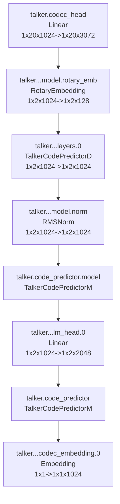

# Qwen3 Omni Model Structure - Talker MTP (Multi-Token Prediction)

```mermaid
flowchart TD
    talker_codec_head["talker.codec_head\nLinear\n1x20x1024->1x20x3072"]
    talker_code_predictor_model_rotary_emb["talker...model.rotary_emb\nRotaryEmbedding\n1x2x1024->1x2x128"]
    talker_codec_head --> talker_code_predictor_model_rotary_emb
    talker_code_predictor_model_layers_0["talker...layers.0\nTalkerCodePredictorD\n1x2x1024->1x2x1024"]
    talker_code_predictor_model_rotary_emb --> talker_code_predictor_model_layers_0
    talker_code_predictor_model_norm["talker...model.norm\nRMSNorm\n1x2x1024->1x2x1024"]
    talker_code_predictor_model_layers_0 --> talker_code_predictor_model_norm
    talker_code_predictor_model["talker.code_predictor.model\nTalkerCodePredictorM"]
    talker_code_predictor_model_norm --> talker_code_predictor_model
    talker_code_predictor_lm_head_0["talker...lm_head.0\nLinear\n1x2x1024->1x2x2048"]
    talker_code_predictor_model --> talker_code_predictor_lm_head_0
    talker_code_predictor["talker.code_predictor\nTalkerCodePredictorM"]
    talker_code_predictor_lm_head_0 --> talker_code_predictor
    talker_code_predictor_model_codec_embedding_0["talker...codec_embedding.0\nEmbedding\n1x1->1x1x1024"]
    talker_code_predictor --> talker_code_predictor_model_codec_embedding_0
```
