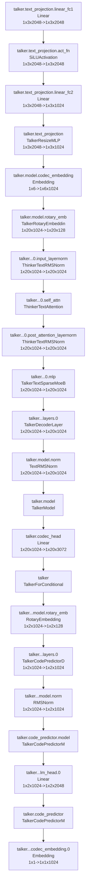

# Qwen3 Omni Model Structure - Talker (Complete Overview)

```mermaid
flowchart TD
    talker_text_projection_linear_fc1["talker.text_projection.linear_fc1\nLinear\n1x3x2048->1x3x2048"]
    talker_text_projection_act_fn["talker.text_projection.act_fn\nSiLUActivation\n1x3x2048->1x3x2048"]
    talker_text_projection_linear_fc1 --> talker_text_projection_act_fn
    talker_text_projection_linear_fc2["talker.text_projection.linear_fc2\nLinear\n1x3x2048->1x3x1024"]
    talker_text_projection_act_fn --> talker_text_projection_linear_fc2
    talker_text_projection["talker.text_projection\nTalkerResizeMLP\n1x3x2048->1x3x1024"]
    talker_text_projection_linear_fc2 --> talker_text_projection
    talker_model_codec_embedding["talker.model.codec_embedding\nEmbedding\n1x6->1x6x1024"]
    talker_text_projection --> talker_model_codec_embedding
    talker_model_rotary_emb["talker.model.rotary_emb\nTalkerRotaryEmbeddin\n1x20x1024->1x20x128"]
    talker_model_codec_embedding --> talker_model_rotary_emb
    talker_model_layers_0_input_layernorm["talker...0.input_layernorm\nThinkerTextRMSNorm\n1x20x1024->1x20x1024"]
    talker_model_rotary_emb --> talker_model_layers_0_input_layernorm
    talker_model_layers_0_self_attn["talker...0.self_attn\nThinkerTextAttention"]
    talker_model_layers_0_input_layernorm --> talker_model_layers_0_self_attn
    talker_model_layers_0_post_attention_layernorm["talker...0.post_attention_layernorm\nThinkerTextRMSNorm\n1x20x1024->1x20x1024"]
    talker_model_layers_0_self_attn --> talker_model_layers_0_post_attention_layernorm
    talker_model_layers_0_mlp["talker...0.mlp\nTalkerTextSparseMoeB\n1x20x1024->1x20x1024"]
    talker_model_layers_0_post_attention_layernorm --> talker_model_layers_0_mlp
    talker_model_layers_0["talker...layers.0\nTalkerDecoderLayer\n1x20x1024->1x20x1024"]
    talker_model_layers_0_mlp --> talker_model_layers_0
    talker_model_norm["talker.model.norm\nTextRMSNorm\n1x20x1024->1x20x1024"]
    talker_model_layers_0 --> talker_model_norm
    talker_model["talker.model\nTalkerModel"]
    talker_model_norm --> talker_model
    talker_codec_head["talker.codec_head\nLinear\n1x20x1024->1x20x3072"]
    talker_model --> talker_codec_head
    talker["talker\nTalkerForConditional"]
    talker_codec_head --> talker
    talker_code_predictor_model_rotary_emb["talker...model.rotary_emb\nRotaryEmbedding\n1x2x1024->1x2x128"]
    talker --> talker_code_predictor_model_rotary_emb
    talker_code_predictor_model_layers_0["talker...layers.0\nTalkerCodePredictorD\n1x2x1024->1x2x1024"]
    talker_code_predictor_model_rotary_emb --> talker_code_predictor_model_layers_0
    talker_code_predictor_model_norm["talker...model.norm\nRMSNorm\n1x2x1024->1x2x1024"]
    talker_code_predictor_model_layers_0 --> talker_code_predictor_model_norm
    talker_code_predictor_model["talker.code_predictor.model\nTalkerCodePredictorM"]
    talker_code_predictor_model_norm --> talker_code_predictor_model
    talker_code_predictor_lm_head_0["talker...lm_head.0\nLinear\n1x2x1024->1x2x2048"]
    talker_code_predictor_model --> talker_code_predictor_lm_head_0
    talker_code_predictor["talker.code_predictor\nTalkerCodePredictorM"]
    talker_code_predictor_lm_head_0 --> talker_code_predictor
    talker_code_predictor_model_codec_embedding_0["talker...codec_embedding.0\nEmbedding\n1x1->1x1x1024"]
    talker_code_predictor --> talker_code_predictor_model_codec_embedding_0
```
