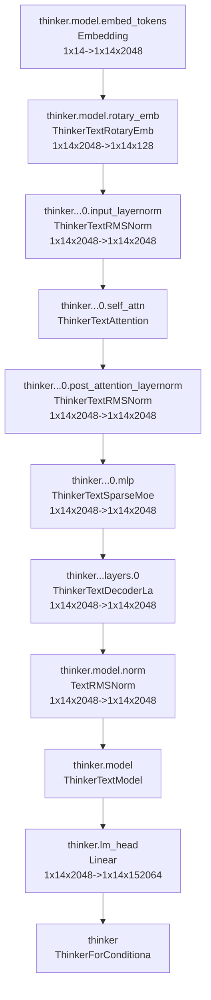

# Qwen3 Omni Model Structure - Thinker (Complete Overview)

```mermaid
flowchart TD
    thinker_model_embed_tokens["thinker.model.embed_tokens\nEmbedding\n1x14->1x14x2048"]
    thinker_model_rotary_emb["thinker.model.rotary_emb\nThinkerTextRotaryEmb\n1x14x2048->1x14x128"]
    thinker_model_embed_tokens --> thinker_model_rotary_emb
    thinker_model_layers_0_input_layernorm["thinker...0.input_layernorm\nThinkerTextRMSNorm\n1x14x2048->1x14x2048"]
    thinker_model_rotary_emb --> thinker_model_layers_0_input_layernorm
    thinker_model_layers_0_self_attn["thinker...0.self_attn\nThinkerTextAttention"]
    thinker_model_layers_0_input_layernorm --> thinker_model_layers_0_self_attn
    thinker_model_layers_0_post_attention_layernorm["thinker...0.post_attention_layernorm\nThinkerTextRMSNorm\n1x14x2048->1x14x2048"]
    thinker_model_layers_0_self_attn --> thinker_model_layers_0_post_attention_layernorm
    thinker_model_layers_0_mlp["thinker...0.mlp\nThinkerTextSparseMoe\n1x14x2048->1x14x2048"]
    thinker_model_layers_0_post_attention_layernorm --> thinker_model_layers_0_mlp
    thinker_model_layers_0["thinker...layers.0\nThinkerTextDecoderLa\n1x14x2048->1x14x2048"]
    thinker_model_layers_0_mlp --> thinker_model_layers_0
    thinker_model_norm["thinker.model.norm\nTextRMSNorm\n1x14x2048->1x14x2048"]
    thinker_model_layers_0 --> thinker_model_norm
    thinker_model["thinker.model\nThinkerTextModel"]
    thinker_model_norm --> thinker_model
    thinker_lm_head["thinker.lm_head\nLinear\n1x14x2048->1x14x152064"]
    thinker_model --> thinker_lm_head
    thinker["thinker\nThinkerForConditiona"]
    thinker_lm_head --> thinker
```
